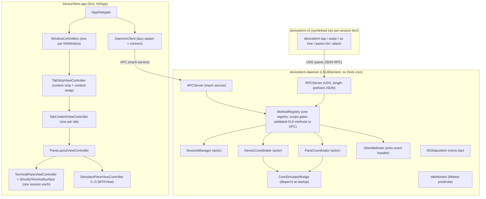
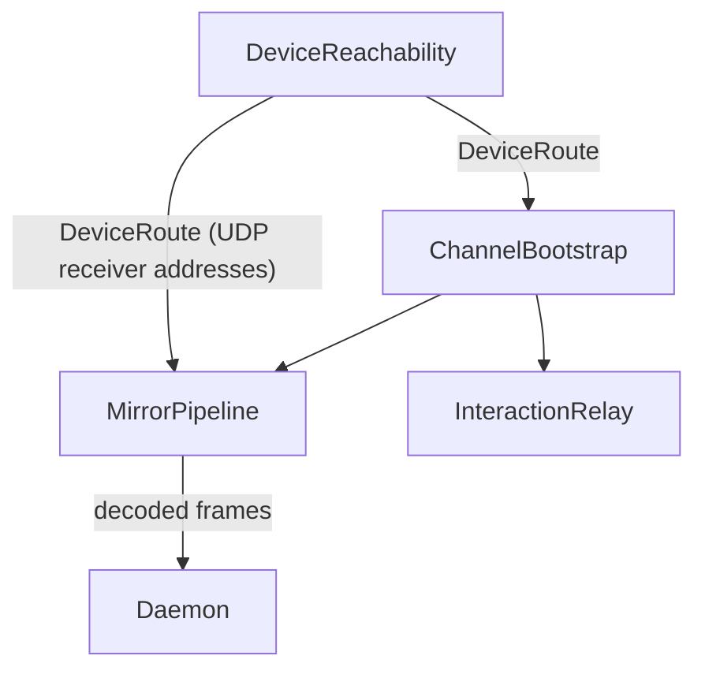
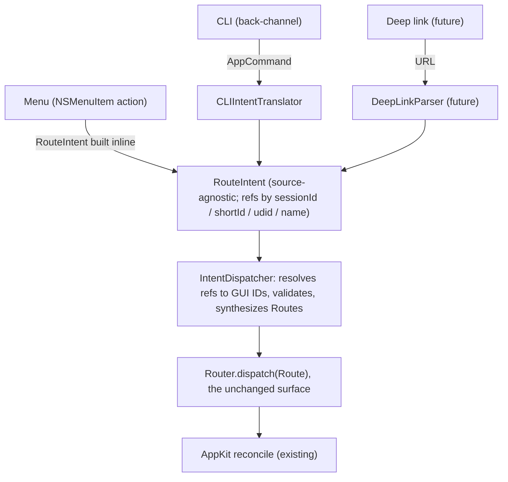
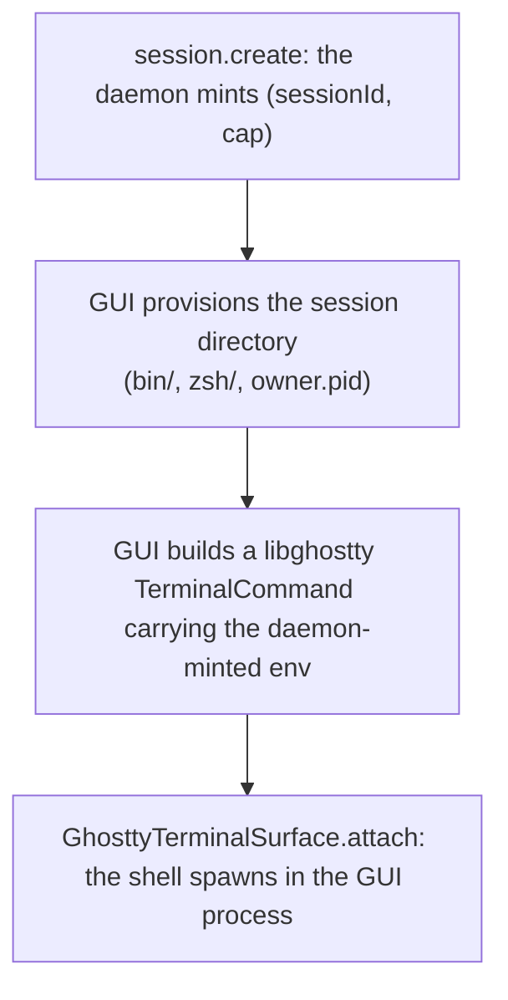

# DeviceTerm Architecture

> This file is the source of truth for how DeviceTerm fits together.
> Update it in the same PR that changes the architecture; reviewers reject PRs that add
> daemon RPC methods, framework-boundary changes, or new private-API selectors
> without a matching update here.

## Overview

DeviceTerm is a macOS-native terminal whose window content is a terminal pane,
optionally alongside one or more mirrored device panes: iOS Simulators, or
connected iPhones and iPads, including network-paired ones, driven over
the CoreDevice tunnel.
The mirrors render and accept input as panes alongside the shell that
started them.
The terminal pane spawns its shell *in the GUI process* via
libghostty's `posix_spawn`; the daemon is not in the PTY path.

The system splits across three processes:



The CLI and shim reach the daemon over the Unix domain socket it vends
alongside the mach service, at
`~/Library/Application Support/deviceterm/daemon.sock`. Configuration stays
in two domains: Ghostty defaults and files drive the terminal surfaces, and
`~/.config/deviceterm/config` drives app behavior (see "Configuration
domains").

Two binaries support this from the side:

- **`deviceterm-shim`**: a wrapper for `xcrun` and `simctl` symlinked into each
  tab's per-session `bin/` directory. Spawns the real binary as a subprocess
  (inheriting stdio, forwarding signals), watches argv for `simctl`
  boot/shutdown and `devicectl` install/launch patterns, and posts
  `shim.event` notifications to the daemon when matched.
- **`deviceterm-probe`**: the compatibility probe. dlopens CoreSimulator,
  enumerates required classes/protocols/selectors, prints `OK` or a
  structured failure report, and exits non-zero if any are missing. The
  required-symbol inventory it checks is compiled into the bridge loader;
  `Sources/CoreSimulatorBridge/as-tested.md` is the human-maintained ledger
  of the same set. It runs explicitly through `make probe`, as part of
  `make verify`, and by checklist convention before a release tag. The production app does not run it on first launch.

One binary sits entirely *outside* this system: the **`deviceterm-uitest`**
harness. It is a dev/test instrument, not a DeviceTerm process: it holds the
Screen Recording + Accessibility grants (so DeviceTerm.app never needs them),
runs as its own signed faceless `.app` launched independently of any tab, and
talks to DeviceTerm only the way any other automation would, through the
window server and the accessibility API, plus the ordinary `deviceterm` CLI.
It is not an RPC peer, has no place in the trust model, and never ships in a
release. See `docs/BUILDING.md`.

## Process layout (`.app` bundle)

```text
DeviceTerm.app/
  Contents/
    Info.plist                     # main bundle
    MacOS/
      deviceterm                   # the GUI executable
    Frameworks/
      Sparkle.framework
    Library/
      LaunchAgents/
        com.deviceterm.daemon.plist  # registered via SMAppService
      LoginItems/
        deviceterm-daemon.app/     # embedded helper bundle
          Contents/
            Info.plist             # LSUIElement=YES
            MacOS/
              deviceterm-daemon
    Helpers/
      deviceterm-cli               # symlinked into per-session bin/
      deviceterm-shim              # symlinked into bin/ as xcrun, simctl
      deviceterm-probe             # explicit compatibility check
    Resources/...
```

The daemon is a *helper bundle* (`LSUIElement=YES`), not a top-level
executable. This lets it host an `NSStatusItem` without showing up in the Dock
or claiming the main menu. It runs as a user-scope LaunchAgent the GUI
registers through `SMAppService.agent(plistName:)`: launchd demand-launches it
on the first send and it idle-exits once nothing needs it, which means no GUI
or CLI peer connected, no live mirror pane whose owning GUI is still alive, and
no DeviceTerm-owned sim still booted. An owned sim left running therefore keeps
the daemon up after every tab is gone, which is exactly what the status item's
iPhone-glyph count is for.

## Daemon lifecycle

The daemon stays in the background. Two transports vend the same
`MethodRegistry`:

- **XPC** (mach service): the GUI's path. The GUI registers an embedded
  LaunchAgent plist via `SMAppService.agent(plistName:)`; launchd holds the
  listener, demand-launches the daemon on the GUI's first send, and applies
  the plist's `KeepAlive={SuccessfulExit:false}` policy to relaunch on
  abnormal exit only.
- **UDS** (Unix domain socket): the CLI and shim path. Each terminal pane's
  shell env carries `DEVICETERM_DAEMON_SOCK` pointing at the socket the daemon
  vends alongside the mach service.

**Spawn:** demand-launched by launchd. The GUI registers the agent at
launch (a no-op when already enabled); its first XPC send then
demand-launches the daemon. UDS traffic can never demand-launch: the
LaunchAgent declares only the mach service, so a CLI or shim call finds
the daemon only because an in-tab caller implies a live GUI that already
brought it up. Outside a tab the CLI reports it cannot connect.

**Stay alive while:** any GUI XPC peer connected OR any CLI UDS peer
connected OR a non-terminal pane exists whose owner GUI is still alive (a
mirror (sim or physical device) survives a momentary connection lapse, but
a pane abandoned by a crashed GUI does not pin the daemon) OR any
DeviceTerm-owned sim is booted. The status item keeps the sim clause visible:
if the daemon is alive holding a sim, the user sees an iPhone glyph and the
count N in the menu bar.

**Idle exit:** no 30 s poll has observed any condition busy for >60 s →
`NSApp.terminate(nil)`. (Sampling is discrete, so the guarantee is "no
sampled activity for the window," not "continuously idle.") launchd's
`KeepAlive` is configured to *not* relaunch
on `SuccessfulExit`, so the daemon stays gone until the next demand-launch.

### State recovery

**GUI-restored, never disk-rehydrated.** The daemon
persists **no** session, device, or pane state to disk: a same-uid-writable
file is untrusted input, so nothing authority-bearing may come from it. A
fresh daemon instance starts **empty** and holds a **restoration barrier**:
until a validated GUI re-supplies its inventory, an `session.authenticate`
for an *unknown* session returns the retryable `-32002` (not the terminal
`-32001`), so an in-tab CLI keeps its bounded retry instead of pruning a
still-valid credential. There are two restart shapes:

- **Daemon-only restart (the GUI stayed alive)**: a crash or idle-exit the
  GUI outlived. On reconnect the GUI **automatically** re-supplies its
  complete live session inventory via `session.restoreBatch` (below) and
  re-binds each terminal (`session.bindTerminal`). Sessions come back because
  a live, signature-validated GUI asserts them, not because a file did.
  Mirror panes come back too, but only after that: the re-attaches are
  session-scoped, so they wait for the restore batch to verify. Once it does,
  the GUI re-attaches every device-backed pane the workspace is still showing,
  sims and physical devices alike. Each one re-attaches into the slot it
  already occupies; a replacement daemon returns a fresh pane id and
  admission, while one that survived the reconnect returns its existing
  record. A target that is no
  longer reachable, a sim shut down while the daemon was gone, becomes a
  failed placeholder with Retry and Close rather than vanishing from the
  layout. A placeholder already sitting failed is retried on the same pass,
  which is what carries a recovery that a *second* restart interrupted: its
  attaches died with the helper, and the panes they were rebuilding are no
  longer mounted for a sweep to find. A pane is one carrier, not the only
  one: a sim DeviceTerm booted and the user then detached keeps running with
  nothing on screen to re-attach. Those come back through
  `device.restoreOwnership` (below), from the GUI's in-memory mirror of the
  owned roster. Nothing new is read for it, because every tab's discovery poll
  already asks `device.list({scope: "owned"})` every couple of seconds and that
  answer is daemon-wide; the mirror is what makes it outlive the daemon that
  gave it. Each read is tagged with the connection that answered, because a
  replacement daemon answers "nothing is owned" correctly and on that same poll
  cadence, so the mirror accepts none of the new connection's reads until
  re-assertion has run, holding the claims it already had. Re-assertion repeats
  only while the helper doesn't answer, inside a bounded window, and never
  re-asks about a claim it declined: the helper judges a claim on current boot
  state, and refuses one that conflicts with attribution it already holds, so a
  claim asked again and again is one that eventually lands on whatever holds
  that udid later. A sim still Booting when the helper evaluates the claim
  loses it for the same reason, and a pane-backed one comes back through
  recovery's Retry instead. Only one read feeds
  the mirror at a time: every tab polls on its own timer, same-connection
  dispatch is not FIFO, and `device.list` vends no revision, so neither the
  order the requests went out in nor the order the answers came back in says
  which snapshot the daemon took later. One in flight does, because the next
  request can't be sent until the previous answer is in hand. A call that
  records ownership (`device.attach`, or a credentialed `device.boot`) tells
  the mirror directly instead of waiting for a poll, which covers a sim owned
  and detached inside one interval: no read ever saw it and the pane that
  would have carried it is gone. A sim CoreSimulator
  still reports as non-Booted when restoration is evaluated is refused rather
  than re-claimed; the daemon knows only current boot state, so one that has
  since been re-booted can be claimed.
  A GUI that just launched has an empty mirror and nothing to re-assert, which
  is the cold-start orphan path below. Owned sims are never auto-shut-down on
  a manifest's say-so.
- **GUI + daemon cold restart**: both gone. **No old session or pane is
  restored.** A fresh GUI creates new tabs through `session.create`. Old
  on-disk simulator files (the GUI's `owned-udids.json`) are an *untrusted
  recovery hint* that can only feed an explicit, human-confirmed orphan
  prompt: never automatic attribution, attach, or shutdown.

Pane re-attach always flows through the normal attach verbs and the shared
pane-creation core they reach: bridge
clients (display/HID/AX/Purple) can't survive a restart, so a fresh record
with live clients is rebuilt rather than resurrected. Post-restart recovery is
that same path run again rather than a second mechanism: the pane becomes an
ordinary attaching placeholder in the slot it already holds, and whatever
mounted it the first time mounts it again, error rendering and Retry included.
Re-attaching a record that did survive is harmless, because the daemon hands
the owning session its existing pane back rather than minting a second, and
the GUI adopts the admission that comes with it. That holds for a physical
device only because its attach carries a resolution failure forward instead of
throwing it: bringing up a tunnel has to happen before `createPane` can say
whether a backend is needed, so an attach that fails there would otherwise
fail a re-attach that never needed one. The failure is raised from `acquire`,
which runs only on a genuine fresh create.

The sim resurrect path (detach + re-attach in place, gated on the sim still
being booted) covers a different case: a sim that shut down under a live daemon
and later re-booted. Physical-device panes have no equivalent watch, so outside
restart recovery they mount only through explicit action or the shim's
contextual auto-attach.

### Crash recovery

`XPCDaemonConnection` observes `XPC_TYPE_ERROR` on
invalidation, drops every in-flight request and subscription, and lets the
next send trigger a fresh `xpc_connection_create_mach_service` → launchd
demand-launch. On that reconnect the GUI **re-runs the wire-version handshake**
first (a Sparkle update may have swapped in a daemon with a different wire
contract; **only a definite version mismatch** routes to remediation, while a
*transient* handshake failure (the daemon still coming up after its respawn)
is retried durably with capped backoff, never mistaken for an incompatible
helper and never abandoned). Remediation for a definite mismatch **issues
`daemon.shutdown` to the incompatible daemon and awaits the ack** (so a
Sparkle-replaced bundle can't leave the old helper alive to be reconnected to),
then surfaces the critical quit/reopen alert, the same startup and reconnect
both take. It runs **at most once per client lifetime**: a latch drops any
second remediation (a superseding reconnect handshake that re-detects the
mismatch), and marking the client incompatible fences the transport so no
new peer, hence no further handshake, can be installed. It can't loop,
double-alert, or restore against the dying daemon. If the shutdown isn't
acknowledged the alert says so honestly rather than claiming the helper
stopped. On a successful (same-version)
reconnect the GUI instead runs the session-restore transaction (durably
retried until the daemon echoes the exact inventory) before its terminals
rebind, so terminals recover. Restoration is not a full transport barrier, so
ordinary calls may race it. Pane recovery is dispatched once per reconnect,
after that restore verifies. A pane's own resubscribe loop can only rejoin a
record that still exists, so it covers a connection that dropped and came back
to the same daemon but not a daemon that was replaced; re-attaching is what
covers the second case, and is idempotent in the first.

### IOSurface delivery

Surfaces ride the XPC channel as side-band payloads
paired with the JSON `surface.changed` evt. The **side-band** carries the
`subscriptionToken`; the JSON event rides its subscription's request-envelope
id, which the GUI maps to that token (via the mapping the subscribe ack
installs). Either way each pair resolves on `(paneId, sequence,
subscriptionToken)`, so two subscriptions on one pane never cross-deliver. The
daemon wraps each `IOSurfaceRef` via
`IOSurfaceCreateXPCObject` and the GUI resolves it with
`IOSurfaceLookupFromXPCObject`: zero-copy, no `kIOSurfaceIsGlobal` mirror
surface, no per-process visibility. The pairing threshold is 250 ms,
swept roughly every 100 ms; a JSON-only timeout yields a `(_, nil)` event
and the GUI holds its last good frame. For a **device** pane the surface is *leased*;
see "Surface lifecycle" under Data flows for the ownership contract that
keeps a slot from being overwritten while the GPU still reads it.

## RPC protocol

**Framing.** Over UDS, length-prefixed JSON: `[uint32 BE length][JSON
bytes]`; a newline-delimited alternative does not compose with
binary-adjacent payloads. Over XPC the same JSON envelope rides as the
`data` field of an xpc dictionary, and libxpc supplies the message
boundary, so no length prefix is used there. Any future binary payload is
encoded as a **base64 JSON string**. The current method set has no binary
payloads. Sim renders travel as XPC-marshalled `IOSurface` objects on a
side-band message, never inline bytes (see "IOSurface delivery").

**Version identity.** `DaemonProtocolInfo.wireVersion` identifies the RPC
contract shared by the app, daemon, bundled CLI, and shim. The GUI uses it to
detect an incompatible helper during an update and replace that helper
cleanly. It is an internal coordination version, not a separate end-user
compatibility promise. The public CLI and JSON contract follows the release
version and is documented in `docs/INTEGRATION.md`.

**Envelope:**

```jsonc
{
  "id": <uint32, monotonic per client>,     // omitted on a notification
  "type": "req" | "res" | "evt",
  "method": "<name>",                       // req or evt only
  "params": {…},                            // method-specific
  "result": {…} | "error": {code, msg}      // res only
}
```

**One-way notifications.** A request with **no `id`** is a fire-and-forget
notification: the dispatcher runs the handler and sends **no response**
(there is no correlation key to reply on). The device-pane surface-lease
methods ride this shape: `pane.surfaceRelease` (the cumulative watermark
ack) and `pane.surfaceDrain` (subscription teardown, not an ack). The
behavior lives in `RPCEnvelope` (decode maps an absent `id` to nil; encode
omits it) and both dispatchers (`RPCConnection`, `XPCConnection`): a
missing `id` routes to the one-shot handler with every reply suppressed.
`pane.surfaceDrain` is additionally intercepted by the XPC connection
before generic dispatch, since its target, the subscription task keyed by
the originating `pane.subscribe` request id, lives on the connection and
no registry handler can resolve it. Responses and events
always carry the `id` of the request they answer.

**Shared types (single source of truth).** Every finite wire value and
client-facing result shape is defined once in the Foundation-only
`DaemonProtocol` module, shared by the daemon, GUI, CLI, and shim: method
names (`RPCMethod`), event names (`PaneEventName`), the `PaneLifecycle` /
`PaneCloseMode` / `HardwareButton` / `Orientation` / `DeviceListScope` /
`ShimEventType` enums, env-var names (`DeviceTermEnv`), the `DeviceFamily`
enum (**lenient**: `family` stays a `String?` on the wire so a newer
daemon can introduce a family without breaking an older client), and the
per-method result/event structs (`DeviceListEntry`, `PanesListEntry`; one
method's types per file). Daemon-only private-API mappings (e.g.
`HardwareButton.bridgeValue` → CoreSimulator) stay daemon-side in
extensions; `DaemonProtocol` never links `CoreSimulatorBridge`.

**Streaming model.** Server-streamed events reuse the request's `id` for
every event frame. The client distinguishes a final `res` from a streaming
`evt` by `type`. The GUI's pane subscription is consumer-pulled: control
events (`state.changed` / `orientation.changed`) queue losslessly in order,
while `surface.changed` is held latest-only (a stalled consumer coalesces to
the newest frame, since that's what would be drawn anyway), so a surface
burst can never evict a control event. Surfaces are bounded latest-only;
control events queue losslessly with no configured bound (the queue drains as
the consumer pulls).

**Reconnect / resubscribe.** Each pane's `SimulatorPaneViewModel` drives its
own subscription in a retry loop: when the daemon connection drops mid-stream
(the connection finishes the stream on XPC invalidation), it backs off and
re-subscribes: the XPC transport auto-reconnects (launchd demand-launches the
daemon), and the daemon replays current pane state on a matching paneId. A
resubscribe that fails with a transport error (a drop during the subscribe or
its re-authentication) is itself retried after the same backoff. It stops
retrying only on a deliberate terminal state (shutdown/failed) or a terminal
daemon/protocol error from the resubscribe (a missing pane binding after the
daemon restarted; only a fresh attach recovers it). CLI clients are
short-lived and don't resubscribe.

**Bounded requests.** A daemon that stops answering keeps its connection open,
so nothing fails and the GUI waits. Every request `DaemonClient` sends
therefore carries a deadline, except the `app.commands` subscription handshake
(below), and expiry surfaces `DaemonClientError.timedOut(method:)`. The default
is 15 s; `device.boot`, `device.shutdown`, and `pane.create` block inside
CoreSimulator for as long as the device takes, so they get 120 s.

**A deadline ends the wait, not the work.** Nothing cancels the daemon's
handler, so the call may still complete. For an ordinary request the transport
is cancelled and the late reply discarded; the mutation's outcome is then
unknown, but none of those calls return a one-time identity, so nothing is lost
that the GUI would need to name what it may have changed. The calls that do
return one are bounded by their caller through `Deadline.wait`, which leaves
the call running and reconciles whatever it produced. Both reconciliations are
best-effort: `session.create` attempts to close a session no tab ever received,
and `Router.runAttach` attempts to detach a pane no window is showing, skipping
it when another mounted or attaching pane claims that target. The detach then
defers until nothing is attaching it, so a replacement that fails releases the
pane it was holding. An attach also waits out a detach already in flight for
its target, because dispatch is non-FIFO and the daemon would otherwise be free
to hand it the record being closed. That fence covers the GUI's wait on the
close. Past it the outcome is unknown, so every close the GUI issues also
carries `expectedAttachment`: a close whose admission has been superseded is
refused daemon-side, which is what makes a late one harmless.

**Expiries are also the detection signal.** `DaemonClient` counts consecutive
ones and reports the daemon unresponsive from the second in a row onward, with
any reply (including a refusal, which is still a reply) resetting the count.
One expiry is not evidence: a call can legitimately outlast its bound, and the
bounds are not uniform, so two in a row is the heuristic rather than a proof of
a wedge. The Router's attach deadline is not one of the two: it is raised in
the Router and never reaches the client, so an attach that expires doesn't
lengthen the streak, though its eventual reply still clears it. What is counted
reports a condition rather than an edge, on every unanswered call past the
threshold: a
daemon that never answers again produces nothing else, so signalling only the
first would give the GUI one chance to act on something still true minutes
later. The count changes nothing about what the client does; it keeps issuing
and bounding calls either way.

The GUI decides when to act on the repeats, because only it knows what is
already on screen. It raises a prompt offering **Restart Helper** or **Keep
Waiting**, and carries a permanent **Restart Helper…** item in its app menu so
recovery never depends on the prompt being up at the right moment. Answering
the prompt either way quiets the detector for two minutes: long enough that a
user who chose to wait isn't asked again while they wait, or that a replacement
gets a chance to come up, and short enough that either of them being wrong
doesn't strand the user. Restarting takes the
pid from `xpc_connection_get_pid` on the live peer, never from an RPC reply (a
daemon that has stopped answering sends none), and reads the peer and signals
it in one actor turn, so the GUI can't swap its own connection underneath the
lookup. The pid is still a pid: the process may exit between the two calls and
the kernel may reuse its number, so `ESRCH` is treated as "already gone" rather
than a failure, and a number reused in that same instant isn't something a
pid-based kill can rule out. The prompt fences its kill to the connection it
was raised against, so a connection superseded while the prompt sat on screen
reports that rather than the current peer being signalled in its place. SIGKILL, because a daemon stopped
with `kill -STOP` never dequeues SIGTERM. A kill the system refuses is
surfaced; the GUI does not claim a restart that did not happen. Nothing
restarts the daemon directly: launchd demand-launches the replacement on the
next send, and recovery rides `session.restoreBatch`, the existing attach
verbs, and `device.restoreOwnership` for the sims no pane carries.

**Two deliberate gaps.** The `app.commands` handshake is not bounded. The
daemon keeps one subscriber and a new subscribe evicts the incumbent, XPC
dispatch is non-FIFO, and no wire method retires a raw subscription, so a
handshake the GUI abandoned could be handled after the retry that replaced it
and unseat a working subscriber. Nothing waits on that handshake, so parking it
is the cheaper failure. Separately, a session whose capability the daemon
refuses to authenticate cannot be closed by the GUI at all: every removal path
is session-scoped, a first create leaves the connection with no other principal
to borrow, and a same-epoch `session.restoreBatch` cannot reap it, because a
live create's assertion outranks a restore baseline at that epoch. It clears on
the next connection epoch, and `DaemonClient` logs it rather than reporting a
cleanup that did not happen.

**Method reference.** The method names below are the single source of truth
`RPCMethod` enum (`Sources/DaemonProtocol/RPCMethod.swift`): the daemon
registry is keyed by its `rawValue`s and clients build requests from its
cases, never raw method-name literals. Two drift guards hold this section to
the code: a `DaemonTests` guard asserts the registry's keys exactly equal
`RPCMethod`'s cases, and a `CLITests` guard asserts every case has an entry
heading below. A new method lands with a new entry.

Each entry lists the wire shape and the scope the dispatcher enforces:

- **daemon-wide**: any connection, authenticated or not.
- **session**: an authenticated connection (a valid cap joined by a matching
  provenance arm, re-checked on every request; see "Provenance & trust
  model").
- **validated GUI**: the signature-validated GUI peer over XPC; UDS can
  never reach it.
- **orchestrator tab**: a session holding a live orchestration grant,
  re-checked per request. Over UDS any granted, provenance-checked session
  qualifies; over XPC only the validated GUI peer does.

Results shown as `{ok}` are the shared ack shape. Optional fields are marked
`?` and are omitted from the wire when absent unless an entry says
otherwise.

### Daemon methods

#### `daemon.ping`

- Params: `{}`
- Result: `{version, pid}`
- Scope: daemon-wide

Used for the wire-version handshake.

#### `daemon.capabilities`

- Params: `{}` (body ignored)
- Result: `{role, allowedMethods, wireVersion, linkagePolicyVersion}`
- Scope: daemon-wide

Discovery method advertising the caller's role and the methods they may
invoke. Authority is the provenance-checked connection, not the request
body: no `(sessionId, cap)` is read from the payload, so a stolen cap can't
surface a victim's role or grant advertising.

`role` is descriptive metadata only. The orchestrator surface in
`allowedMethods` follows the session's live orchestration grant and
transport, never its role, so advertising matches exactly what dispatch
enforces: a granted agent session is advertised the orchestrator verbs, and
an ungranted orchestrator session is not.

Works with or without an authenticated connection: an unauthenticated
(out-of-tab) connection gets `role: null` plus the daemon-wide subset. It
powers the role line `deviceterm help` prints above its command list (the
list itself is never filtered) and `deviceterm doctor`'s allowedMethods
axis. `linkagePolicyVersion` is the forward-compatibility slot for
linkage-policy changes; nothing consumes it yet.

#### `daemon.events`

- Params: `{}`
- Result: `{ok}`, then a stream of `daemon.event` frames
- Scope: session

Session-scoped event subscription: the caller sees its own session's pane
state changes and session lifecycle, plus device boot/shutdown events,
which go to everyone (a udid leaks nothing `device.list` doesn't). The
audience is filtered daemon-side by an internal `EventAudience`, never on
the wire; the validated GUI peer spans sessions and sees every event. An
unauthenticated caller is rejected at the scope gate.

Each frame's method name is `daemon.event` and its params are one flat
`{type, ts, paneId?, udid?, state?, sessionId?, shortId?, name?}` object
with absent keys omitted. `type` is one of `pane.stateChanged`,
`device.booted`, `device.shutdown`, `session.created`, or
`session.closed`. Powers `deviceterm events`.

#### `daemon.shutdown`

- Params: `{}`
- Result: `{ok}`
- Scope: validated GUI

Flushes the `{ok}` ack, then exits via `NSApp.terminate` so
`applicationWillTerminate` unlinks the socket cleanly; the ack flushes
first so the GUI can tell an accepted shutdown from a transport loss.

Its sole production use is the GUI terminating an incompatible old helper
after a definite update-related wire mismatch. Sparkle can replace
`DeviceTerm.app` while a daemon holding an owned booted sim stays alive
(quitting the GUI does not necessarily stop it); without this, a
relaunched GUI could repeatedly reconnect to the same incompatible daemon.
The GUI issues it, awaits the ack, then follows the quit/reopen
remediation; the next launch demand-launches the updated helper.

No UDS caller, session credential, orchestration grant, or unvalidated XPC
peer can reach it. That closes the unauthenticated confused-deputy
surface, though it does not claim to prevent every same-uid, signal-level
DoS. Ordinary daemon lifecycle still uses idle exit, not this method.

### Sessions

#### `session.create`

- Params: `{label?, name?, role?, initialPrivate?}`
- Result: `{sessionId, capability, shortId, name?, role}`
- Scope: daemon-wide

The capability is a 32-byte token, returned only here. The caller uses it
to authenticate the connection (`session.authenticate`), not to prove
provenance; see that entry.

The daemon captures the creating process's kernel identity (the "owner"
provenance arm) server-side from the transport peer, the audit token on
XPC or the `LOCAL_PEERTOKEN` identity on UDS, so no caller-supplied owner
pid rides on the wire.

`shortId` is a 6-char Crockford base32 identifier the `--tab <ref>`
resolver uses. `name` is stored verbatim from the request and never
renamed afterward; the GUI supplies a worktree-derived branch when it
detects one. `role` defaults to `"agent"`.

Every XPC `session.create`, whatever the role, must come from the
validated GUI: XPC is the GUI's transport, and only a validated session is
marked restorable (its close leaves a tombstone; see
`session.restoreBatch`). An unvalidated XPC peer is refused with a
verdict-stability split: a transient `.unavailable` verdict (the signature
walk couldn't complete) returns the retryable `notReady` so a recoverable
blip self-heals, while a stable `.rejected` signature mismatch (a rogue
peer) is a hard `roleViolation`.

`role: "orchestrator"` is additionally refused outright over UDS; only the
human GUI mints it, so the human-only escalation property is enforced by
the daemon, not by convention. UDS agent creates carry no GUI validation
and are unaffected.

`initialPrivate` (default false) seeds the privacy flag in the same actor
turn the session is inserted. The GUI passes `true` for a terminal joining
an already-private tab, so the new session is never observable as public
on `tabs.list`; a follow-up toggle would race the create's own publish.

#### `session.authenticate`

- Params: `{sessionId, cap}`
- Result: `{ok, role}`
- Scope: daemon-wide

Binds the calling connection to the named session for its lifetime; the
dispatcher then authorizes session-scoped methods from the connection's
auth state rather than per-call creds. A few legacy handlers
(`session.close`, `panes.list`, `pane.create`, `device.attach`,
`shim.event`) still carry `(sessionId, cap)` in their params and
re-validate it, and `device.boot` optionally carries the pair for
ownership attribution, validated the same way when present. The dispatcher
intercepts this method on both
transports; the registry holds a deliberately unreachable stub so the
drift guards and `daemon.capabilities` still see it.

A valid cap is necessary but not sufficient: the cap is inherited env,
readable by any same-uid process (`ps -E`), so possession alone can't
authenticate a session. The daemon additionally checks the peer's kernel
identity against one provenance arm (the validated GUI on XPC, the exact
process that created the session, or the session's bound terminal on UDS
via `session.bindTerminal`) and installs the principal only if one
matches.

Three authentication outcomes exist once the params parse (a malformed
`sessionId` or `cap` is `invalidParams` before any of them). `ok` means a
provenance arm matched. `error.unauthorized`
(`-32001`) means a stale or wrong cap, or a wrong terminal; it is
terminal, don't retry. A distinct retryable `-32002` covers a live session
whose terminal anchor hasn't been bound yet (right after a restart), a
transient XPC validation blip, or an unknown session on a fresh daemon
still awaiting its validated-GUI restore batch (the restoration barrier;
see "State recovery"), so a stale in-tab CLI keeps its bounded retry
instead of pruning a still-valid credential. Once a restore batch, even an
empty one, completes, an unknown session is terminally `-32001`.

Provenance is re-checked on every scoped request, not just at
authenticate, so closing a session or revoking its anchor invalidates an
already-authenticated socket. Re-auth on an already-authenticated
connection replaces the prior state, last-write-wins.

#### `session.bindTerminal`

- Params: `{sessionId, foregroundPid, ttyName}`
- Result: `{ok}`
- Scope: validated GUI

The peer's audit token is the authority, so no `(sessionId, cap)` rides on
the wire. The GUI reads its terminal surface's foreground process pid and
controlling tty from libghostty (`ghostty_surface_foreground_pid` /
`ghostty_surface_tty_name`) and sends them here so the daemon can derive
and store a terminal anchor: the POSIX session id, controlling TTY device,
and session-leader start time, re-derived from the kernel. The raw pid is
verified then discarded, never retained.

A later in-tab UDS caller's `session.authenticate` matches its own kernel
identity against this anchor. That is the "terminal" provenance arm: it
lets a non-owner in-tab process (the CLI, the shim) authenticate as the
session, while an out-of-tab cap thief on a different POSIX session or tty
cannot.

The GUI re-binds after a reconnect or daemon restart; the anchor store is
in-memory and lost on restart, and a connection teardown revokes the
anchors it issued. Idempotent; binding a different terminal to a live
session is refused.

#### `session.close`

- Params: `{sessionId, cap, mode?}`
- Result: `{ok}`
- Scope: session

Tab close converges here. The daemon currently ignores `mode` (`"detach"`
or `"shutdown"`); the GUI fans out `device.shutdown` itself when the user
picks "Shut Down".

#### `session.restoreBatch`

- Params: `{sessions: [{sessionId, capability, shortId, role, name?, isPrivate}], revision}`
- Result: `{restoredCount, sessionIds}`
- Scope: validated GUI

The audit token is the authority, and the issuer plus each restored
session's owner are captured from the validated XPC peer server-side,
identical to `session.create`, never from the payload. Only `revision` is
a wire field: the epoch is the XPC connection id and the tier is a
server-side constant, both derived at dispatch.

A validated GUI re-supplies its complete live session inventory, both to
bring sessions back to a fresh daemon after a daemon-only restart (the
sole path by which sessions come back; nothing is rehydrated from disk)
and as ongoing authoritative reconciliation whenever its live session set
changes. The daemon re-derives each session's non-recoverable verifier
from the supplied bearer cap, so the in-tab cap keeps authenticating.

The batch is authoritative, `(epoch, tier, revision)`-fenced, and
all-or-none. The connection id is the epoch and the GUI's monotonic
`revision` orders same-connection retries; a restore carries the lower
`restore` tier, which sits below the `live` tier of any `session.create`
membership stamp or `session.setPrivateBatch` at the same epoch. A
strictly older restore key is rejected; an equal key may replay
idempotently.

It is otherwise validated in full: a malformed UUID, cap, or short-id, an
in-batch duplicate id or short-id, a verifier conflicting with a live
session, or a short-id colliding with a different live session are all
rejected `invalidParams`. It then applies as one atomic actor segment.
Absent sessions are inserted. A live session the complete inventory omits
is reconciled away as an abandoned ghost (a lost `session.close`) when
this batch's key strictly dominates the key that last asserted it, so a
session that a newer connection or a higher-revision same-connection retry
drops is reaped, while a live `session.create` (higher tier) that merely
raced this restore survives. A live session's privacy is updated under
this batch's key, so a newer restore corrects it while a
`session.setPrivateBatch` the user made after the restore still wins by
its higher tier.

A session closed since the inventory was captured is not resurrected: a
close tombstone fences it. Session ids are unique, so a closed id is dead
for good; the GUI retains a closing terminal until `session.close`
returns, so a concurrent retry can still list it. Only a session a GUI
restore could ever list is tombstoned, one the validated GUI minted or
restored: a UDS or unvalidated-peer session (an agent's own, or an
attacker churning create/close) never appears in a GUI inventory, so its
close never tombstones.

Every legitimate GUI session is restorable from creation: an XPC
`session.create` from an unvalidated peer is refused with the retryable
`notReady` (the GUI retries rather than minting a non-restorable session),
and a validated inventory that lists an existing session also confirms it
restorable. A transient validation failure (an `.unavailable` verdict,
carried through the dispatch context) is retryable everywhere, including
the orchestrator mint, so a recoverable blip doesn't fail opening a tab;
only a stable signature mismatch is a hard refusal.

The only sound reclaim for a tombstone is a restore that omits the id. The
GUI's restore loop is serial (it awaits each reply before the next), so
once the daemon processes a restore omitting an id, every earlier restore
has already been processed and every later one was captured after the
close, so none can resurrect it, even a restore still parked in XPC
validation or scheduling. XPC dispatch is non-FIFO, so a transition-count
or wall-clock expiry would be unsound.

To bound the tombstone set between reconnects, `restoreBatch` is ongoing
authoritative inventory reconciliation, not restart-only: the GUI's
`InventorySyncCoordinator`, the single `restoreBatch` caller, re-supplies
the live inventory whenever the workspace session set changes, so a closed
session's tombstone is reclaimed by the next omitting inventory. It uses
bounded coalescing: one batch in flight, a fixed coalescing window, a
synced watermark that advances only on a verified echo, a forced follow-up
after a mutation mid-batch, failures that stay dirty and retry, and
steady-state syncs that fire no terminal rebinding.

Privacy is seeded fail-closed in the same actor turn, so a mid-transition
tab restores private, never briefly public. Entry order defines the
restored set's `tabs.list` order. Processing any non-stale batch,
including an empty one, releases the restoration barrier (see
`session.authenticate` and "State recovery"). The GUI re-sends its whole
inventory with a fresh revision on every reconnect. The bearer cap is
never logged or interpolated into an error.

#### `session.setPrivateBatch`

- Params: `{sessionIds, isPrivate, revision}`
- Result: `{applied, revision, isPrivate}`
- Scope: validated GUI

The peer's audit token is the authority: no `(sessionId, cap)` handshake
rides on the wire, and a UDS caller is refused with
`error.role_violation`.

Atomically flips the privacy flag for every session backing one tab. The
daemon validates that all ids name live sessions before mutating, then
applies the whole set in one actor turn, so a multi-terminal tab can never
end up torn, some private and some public.

The daemon is the ordering authority for last-write-wins. It pairs the
client's `revision` with a server-derived epoch (the monotonic XPC
connection id) into an ordering key and, all-or-none, applies the batch
only when that key strictly dominates every target session's last-applied
key; otherwise it returns `applied: false` without mutating. This lets the
GUI stop serializing sends: an older write arriving late, even across an
XPC reconnect or a GUI restart replaying low revision numbers (which the
higher epoch defeats), loses.

`isPrivate` is the desired absolute state, idempotent on retry. A returned
`applied: false` (stale) is not an ordinary success: the GUI commits
presentation only from an `applied: true` reply and reconciles ambiguous
outcomes via `session.privacySnapshot`, never from a request-time
snapshot.

A private session disappears from `tabs.list` for every caller except the
owner; the daemon's `sessions(visibleTo:)` filter reads the dispatcher's
`originatingSessionId` task-local. The GUI is the only legitimate caller:
it resolves a tab to its session set and applies the owner check GUI-side
before building the batch.

#### `session.privacySnapshot`

- Params: `{sessionIds, revision}`
- Result: `{fenced, revision, sessions: [{sessionId, state}]}`
- Scope: validated GUI

An ordering-fenced authoritative read of tab privacy, under the same
audit-token authority as `session.setPrivateBatch`. In one actor turn the
daemon snapshots each session's confirmed state (`"public"`, `"private"`,
or `"missing"`) and, iff the request's `(epoch, revision)` key strictly
dominates every live requested session's key, advances them all to that
key without changing privacy.

That advance is the fence: a delayed older write now fails the dominance
check and returns `applied: false`, so the snapshot the GUI receives
cannot already be obsolete. `fenced: false` (a newer authority already
exists on some session) means the states may be about to change, so the
GUI treats the result as unresolved.

Read-only: privacy is never mutated. The GUI reconciles tab presentation
from a fenced, uniform-public result (else the tab stays hidden and
unresolved) after a definite rejection, a stale `applied: false`, or a
superseded indeterminate send.

#### `session.setDisplayTitle`

- Params: `{sessionId, title: String|null}`
- Result: `{ok}`
- Scope: validated GUI

The peer's audit token is the authority; no capability rides on the wire,
and a UDS caller is refused with `error.role_violation`.

Publishes the tab's live label (the shell's OSC 0/2 title, a manual
rename, or whatever else won the GUI's title precedence) in the optional,
bounded, normalized form `tabs.list` serves in place of the static `name`
stamped at `session.create`. It is omitted whenever it would say nothing
`name` does not already, and readers fall back to `name` whenever it is
absent.

The GUI is the only writer by construction: it is the only process that
sees OSC sequences. It pushes under the tab's primary terminal's session
(a tab holds N terminals with N sessions; the other sessions carry no
`displayTitle`), coalesced in fixed 150 ms windows. A fixed window rather
than a resetting debounce means a continuously-retitling shell still
flushes once per window instead of being postponed indefinitely. The GUI
republishes each live tab's title after a reconnect, once the session
inventory has been re-supplied, so the push lands on a session the daemon
holds. That republish is required because the daemon cache is memory-only:
a daemon restart or connection replacement would otherwise leave
`tabs.list` reporting the session name until the next OSC event, which
may never come.

A refusal that says the transport structurally can't accept the method
stops that tab's publisher rather than earning a refusal for every title
the shell emits; how long it stays stopped follows the cause. Not being
the validated GUI is stable for the life of the process (either the
`--smoke` UDS fallback, which carries no audit token at all, or an XPC
peer whose signature check came back a stable mismatch; an ephemeral
verdict gets its own retryable code), so that stop is permanent. A daemon
predating the method is a property of that daemon (an idle exit or a
crash replaces it without the GUI restarting), so that stop is scoped to
the connection, and the reconnect republish re-arms it.

`title` is optional and a null clears it: normalization can reduce a
non-empty title to nothing, so the clear is transmitted as an explicit
JSON null rather than skipped, or the previous label would outlive the
value that replaced it. `sessionId` must name a live session; otherwise
`error.unauthorized` with its own message, since this method carries no
capability and the shared "invalid sessionId or cap" would name a factor
the caller never sent. A stale queued push therefore can't accrete titles
for dead sessions, and the entry is dropped when the session closes.

The title is normalized on both sides of the wire: C0/C1 controls,
line/paragraph separators, and every `Default_Ignorable_Code_Point`
stripped. Using the property rather than an enumerated deny-list covers
`Bidi_Control` overrides, the invisible-but-not-whitespace scalars (soft
hyphen, ZWSP, word joiner, BOM), and the tag characters used for
invisible-text smuggling, with narrow exceptions for the joiners and
variation selectors that are necessary inside a visible cluster. The
result is NFC-composed and truncated on grapheme boundaries to a 256-byte
budget: client-side to bound the payload, daemon-side as the enforcement
that holds regardless of client.

A title that survives as nothing, or as nothing that renders, normalizes
to absent. That last check extends the guarantee to the blank scalars no
Unicode property identifies, namely `U+2800` BRAILLE PATTERN BLANK, which
is handled as a space: trimmed at the edges, never counted as content,
but kept between braille characters where it is the word separator.

A push arriving from a connection strictly older than the one that last
wrote that session's title is dropped: handler tasks are not FIFO, so a
push admitted on a connection the GUI has already replaced could
otherwise resume after its successor's and reinstate a superseded label.

#### `tabs.list`

- Params: `{}` (body ignored)
- Result: bare array `[{sessionId, shortId, name?, displayTitle?, label?}]`
- Scope: daemon-wide

One entry per live session; sessions are minted per terminal pane, not per
tab. `name` is the session's worktree branch captured at `session.create`;
`shortId` is the 6-char handle used by `--tab <ref>`. The result is a bare
array, not a wrapper object.

`displayTitle` is the GUI's live tab label as last pushed via
`session.setDisplayTitle`, in the optional, bounded, normalized form
described there. It is not an identifier and never resolves a
`--tab <ref>`, since it changes as often as the shell redraws its prompt;
readers fall back to `name` whenever it is absent. It is absent when no
GUI has pushed one (including after a daemon restart, until the GUI
republishes), when the tab's label carries nothing beyond `name` (the
label is the name, or the GUI's generic fallback for a tab with no name,
no title, and no known directory), and for the non-primary terminals of a
split tab. For a non-private session it is public metadata: a program
that emits an OSC title is publishing that string to every observer that
can see the tab.

A fresh daemon starts with no sessions (nothing is rehydrated from disk);
the list is populated by `session.create` and by the validated GUI's
`session.restoreBatch` after a daemon-only restart, so it never
accumulates a cross-restart graveyard. Private sessions are visible only
to their owner.

#### `panes.list`

- Params: `{sessionId, cap}`
- Result: bare array `[{paneId, udid, state, family, shortId, name?, capabilities, target}]`
- Scope: session

The session's panes. The payload `(sessionId, cap)` is provenance-checked
and must name the connection's own session; the validated GUI peer is the
sole cross-session exception. `family` is the coarse device
class; `capabilities` and `target` are as in `pane.create`.

Backs `deviceterm panes list` and the CLI's pane resolution: input
commands resolve their target paneId through this (default is the
session's sole device pane, `--pane` to disambiguate).

### Devices

#### `device.list`

- Params: `{scope: "owned"|"all"}`
- Result: bare array `[{udid, name, state, ownedBySession?, family, deviceType?}]`
- Scope: daemon-wide

`family` is the coarse device class (`watch`/`phone`/`pad`/`tv`/
`unknown`), classified by the daemon from the device type. `deviceType`
is the human-readable device type name (for example "iPhone 17 Pro"),
absent only when the bridge couldn't read it. `state` is the
CoreSimulator state name: `"Creating"`, `"Shutdown"`, `"Booting"`,
`"Booted"`, `"ShuttingDown"`, or `"Unknown"`. The result is a bare
array, not a wrapper object.

#### `device.boot`

- Params: `{udid, sessionId?, cap?}`
- Result: `{ok}`
- Scope: session

Returns when CoreSimulator accepts the boot intent. When `sessionId` and
`cap` are both provided, the boot is recorded as owned by that session,
feeding `device.list({scope: "owned"})` and the menu-bar count. Omitting
both skips ownership attribution; the connection must still be an
authenticated session either way, so there is no unauthenticated boot
path. Providing one without the other is `invalidParams`.

#### `device.shutdown`

- Params: `{udid}`
- Result: `{ok}`
- Scope: daemon-wide

Carries no credentials: UDS access is user-scoped and the user can
already run `xcrun simctl shutdown` directly; disowning on shutdown is
bookkeeping.

#### `device.attach`

- Params: `{udid, sessionId, cap, revision?}`
- Result: as `pane.create`
- Scope: session

Transfers ownership of an already-booted udid to `(sessionId, cap)` and
creates a sim pane in one shot. `family`, the coarse device class, is the
uniform source the GUI sizes from, since every attach path returns it;
`capabilities` and `target` are as in `pane.create`.

This sim attach keeps its legacy `{udid, sessionId, cap}` param shape,
the known exception; the newer `physicalDevice.attach` uses
connection-auth instead. Orphan re-attach and most pane creation use this
rather than `pane.create`, which only creates the pane and leaves daemon
ownership pointed at any prior owner.

#### `device.restoreOwnership`

- Params: `{devices: [{udid, sessionId?}]}`
- Result: `{restoredCount, udids}`
- Scope: validated GUI

The simulator counterpart to `session.restoreBatch`. A validated GUI restores
DeviceTerm's owned-sim claims to a daemon that came back holding nothing,
preserving live session attribution where there is any. A sim carried by a pane is restored by re-attaching the pane;
this is what brings back one the user detached, which has no pane to carry it.
The audit token is the authority, so no capability rides on the wire, and UDS
can never reach it: asserting ownership on another session's behalf is exactly
what a UDS caller must not do.

Additive, not a complete inventory. It never reaps a udid the batch omits, and
never overwrites an attribution the daemon already holds, because the live map
is newer than any mirror a caller can hold. Re-asserting the owner a sim
already has counts as restored, so a retry, or a race with the pane re-attach
that recorded the same thing, is idempotent.

Syntax is validated batch-wide (a malformed or duplicated udid rejects the
whole thing), and the surviving claims are then handled independently: a
non-booted or conflicting claim is omitted, while a dead-session claim is
demoted before admission and accepted when nothing else conflicts.

Ownership and attribution are separate answers, in the params and in the
daemon's map. A null `sessionId` asserts ownership with no attribution, which
is not the same as sending no claim: it is the sim a tab closed with Detach left
running, still DeviceTerm's and listed under "Unlinked" in the status item, with
the session that booted it gone.

A *named* session the daemon doesn't hold live is demoted to that same
unattributed state rather than refused, and a newly written attribution is
re-checked after the commit and demoted if its session died in between (the
check and the commit are separate actor hops). An attribution the daemon
already held is not revisited. Refusing would leave a running Simulator nothing claims, so nothing
offers to shut it down, and whether an attribution still resolves can change
under a caller that read it a moment ago. Ownership is what the caller asserted,
so a demoted claim still counts as restored.

Fail-closed on the Simulator itself. A udid CoreSimulator does not report as
`Booted` right now is neither claimed nor reported, including one the daemon
already attributes, since nothing disowns a sim that shut down until the
notifier says so. A CoreSimulator that can't enumerate reports nothing rather
than guessing.

Neither boots a sim nor mints a pane, and it publishes no `device.booted`
event: no sim changed state, and a subscriber told otherwise would see a boot
that never happened. Every entry is parsed before anything is touched, so a
malformed or in-batch-duplicate udid rejects the whole batch `invalidParams`
with nothing mutated. `udids` is what stuck, lowercased and sorted.

#### `physicalDevice.list`

- Params: `{}` (body ignored)
- Result: bare array `[{deviceId, name?, model?, osVersion?, available, unavailableReason?}]`
- Scope: daemon-wide

Every physical device `devicectl list devices` reports, including
network-paired ones whose tunnel is down; empty when devicectl reports
none, and a failed enumeration degrades to an empty roster. The
enumeration is usbmux/lockdown (no Device Hub needed), so `deviceId` is
the device's real UDID; `model` and `osVersion` disambiguate two devices
that share a name.

Not a mirror-capability probe: `available` is always `true` today (every
connected device is selectable), and mirror capability is judged at
attach. `available`/`unavailableReason` are the forward slot for a future
picker that pre-greys rows via an async per-device probe. Feeds the GUI
"Mirror Physical Device…" picker. Device availability leaks nothing
tab-private, hence daemon-wide.

#### `physicalDevice.attach`

- Params: `{deviceId, sessionId?, revision?}`
- Result: as `pane.create`
- Scope: session

Mounts one physical device as a pane. The originating session is read
from the connection's authenticated context, the connection-auth
convention for new verbs; contrast the legacy sim `device.attach`. The
optional `sessionId` is attribution, not a credential: it is honored only
for the signature-validated GUI peer, which spans sessions, and ignored
for UDS callers.

Attached through explicit action or the shim's contextual auto-attach, plus
restart recovery re-attaching a pane the workspace is still showing. No
resurrect watch: there is no physical equivalent of the sim's
detach-and-re-attach-in-place path. A device whose iOS is too old to
mirror (the catalog vends no displayservice) returns `invalidParams` with
a "needs a newer iOS" reason; an absent or locked device returns a clear
`invalidParams`/`serverError`. `family` reads `unknown` for device panes;
the GUI sizes them from the surface stream instead.

#### `devices.list`

- Params: `{}` (body ignored)
- Result: bare array
  `[{id, kind, name?, model?, osVersion?, state?, attached, ownerSessionId?}]`
- Scope: session

The aggregate live roster: booted owned sims plus the physical devices
`devicectl` reports, each annotated with whether a pane the caller can
see mirrors it. `kind` is `"sim"` or `"device"`. `model` and `osVersion`
are physical-device only, from the cheap tunnel-down
`devicectl list devices` enumeration, and disambiguate two
connected devices that share a name.

Not a `simctl list` or `devicectl list` clone: it never enumerates
shutdown or never-booted sims; the value added is the pane and ownership
layer. The `ownerSessionId` annotation obeys the same private-tab opacity
rule as `tabs.list`: a device attached only in a private session the
caller doesn't own reads as `attached: false`. Backs
`deviceterm devices list`.

### Pane lifecycle

#### `pane.create`

- Params: `{sessionId, cap, kind: "sim", udid, revision?}`
- Result: `{paneId, attachment, scale?, family, shortId, name?, deviceType?, pixelWidth?, pixelHeight?, capabilities, target}`
- Scope: session

`attachment` identifies this admission of the pane. A fresh create, an
ownership transfer, and a *revisioned* same-owner re-attach each advance it, so
two callers handed the same `paneId` hold different values. An unrevisioned
same-owner re-attach is idempotent and leaves it alone: that caller doesn't
fence its own closes, so advancing would only retire the token of whichever
caller currently holds it, which never sees that response and would find its
next close refused with the pane still running. The shim's contextual
auto-attach takes that path on every command run in a tab already showing the
sim.

`revision` orders one caller's own attaches. It has to come from the caller,
because `attachment` is assigned in the daemon's processing order and dispatch
is non-FIFO: a caller with two attaches in flight (a timed-out one and its
retry) can have the older handled second, and admitting it would move the
record to an `attachment` that caller never receives, silently invalidating
every close it later sends. A re-attach whose revision doesn't dominate the
one that produced the record's current admission is refused with
`invalidParams` instead. Omit it if you have no series to order, as the CLI
does; the re-attach is then idempotent, and it neither advances `attachment`
nor clears the series, so a stale revisioned request arriving afterwards is
still caught. Pass it back as
`expectedAttachment` on `pane.closeById` to fence a close to the admission it
was meant for. It is deliberately neither the owner's session incarnation
(unchanged by a same-owner re-attach, so it cannot tell two admissions apart)
nor the record's internal epoch (advanced by speculative work that may abort,
so a legitimate close would be refused).

`kind` is reserved as a discriminator; only `"sim"` is valid, and `udid`
is then required. `family` is the coarse device class
(`watch`/`phone`/`pad`/`tv`/`unknown`) so the GUI can size the pane.

`capabilities` is the per-pane control set
(`touch`/`key`/`text`/`button`/`rotate`/`crown`/`accessibility`) clients
gate affordances on, plus `location`, which records backend support and,
like the other flags, gates a client affordance: the Device ▸ Location
submenu, through `PaneControlAffordance.location`. `target` discriminates
sim from device, encoded externally tagged: `{"sim": {"udid"}}` or
`{"device": {"deviceId"}}`.

Both are skew-tolerant: a client that doesn't know them ignores them, and
a peer that omits the block leaves the client on `missingBlockFallback`.
The added `location` flag reads `false` when absent from a present block;
the original fields remain required.

Orphan re-attach and most pane creation use `device.attach` instead: this
method only creates the pane and leaves daemon ownership pointed at any
prior owner.

#### `pane.closeById`

- Params: `{paneId, mode?, expectedAttachment?}`
- Result: `{ok}`
- Scope: session

Daemon-internal primitive used by the GUI Router's fan-out (tab and
window close per-pane shutdown) and by `SimulatorPaneViewModel`'s in-pane
shutdown. The user-facing `pane.close` (under Workspace verbs) is the
ref-based wire shape that flows through the Intent layer. `"detach"`, the
default when `mode` is omitted, drops the pane and leaves the sim
running; `"shutdown"` also shuts down the sim.

`expectedAttachment` is the `attachment` from the attach response the caller
is closing against. When present, the close is a no-op unless the record is
still that admission, checked in the same synchronous step that removes it.
That is what makes a close safe to issue against a record another caller may
have taken over: dispatch is non-FIFO, so a close sent before a re-attach can
be handled after it, and without the fence it would retire the pane the
re-attach just handed back. Omit it to close unconditionally, which is what
the CLI does, having no admission to name.

### Pane input

Every input verb is session-scoped and pane-targeted: the paneId is
authorized per request through `PaneCoordinator.authorize`, so a session
reaches only its own panes and a foreign paneId is a hard reject
indistinguishable from an unknown one.

Three verbs are live streams of contact events driven by the GUI
(`touch`, `multitouch`, `edgeTouch`). `key` sends discrete key-down and
key-up events; the remaining verbs are one-shot inputs or daemon-paced
gestures. A physical-device pane supports the subset advertised in its
`capabilities` block, with one gap today: on a device pane `touch` covers
the single-finger verbs only, and the two-finger `pinch`/`multitouch` are
rejected by the backend (surfacing as `error.bridgeFailed`). Device panes
report `crown: false`; every sim pane advertises `crown`, and restricting
it to watch families is a client affordance concern
(`PaneControlAffordance`), not a daemon gate. Edge gestures ride the
simulator's edge tags on a sim and enriched system-gesture reports on
physical hardware. Coordinates are normalized display coordinates.

#### `pane.input.tap`

- Params: `{paneId, x, y}`
- Result: `{ok}`
- Scope: session

A replayed single tap at normalized coordinates.

#### `pane.input.touch`

- Params: `{paneId, x, y, phase: "down"|"move"|"up"}`
- Result: `{ok}`
- Scope: session

The GUI live-drag path. `down` and `move` send continued Indigo contact
(`tapDown`); `up` releases contact (`tapUp`). Coordinates may fall
outside `[0, 1]` for bezel-origin edge gestures.

#### `pane.input.swipe`

- Params: `{paneId, fromX, fromY, toX, toY, durationMs?, holdMs?, startHoldMs?}`
- Result: `{ok, dispatched?: "tap"|"drag", steps?, durationMs?}`
- Scope: session

The scripted interpolated gesture path; direct GUI drags use
`pane.input.touch`. `durationMs` (default 200) paces the interpolated
motion. `holdMs` (default 0) adds an active dwell at the end point: the
daemon re-reports contact there at a coarse ~30 Hz cadence, each report
nudged a sub-pixel amount so the synchronous HID send completes, then
lifts, so the OS sees the finger decelerate to a stop while still down,
which a plain swipe-and-lift can't express. `startHoldMs` (default 0) is
the same active dwell at the start point, before the motion begins.

The ack reports how the daemon dispatched the gesture (`tap` or `drag`),
the interpolation step count, and the effective duration. A current
daemon always sends all three; they are optional only for old-daemon
skew.

#### `pane.input.edgeSwipe`

- Params: `{paneId, fromX, fromY, toX, toY, edge, durationMs?, holdMs?}`
- Result: `{ok}`
- Scope: session

An edge-tagged drag that drives the OS system gestures (home indicator,
App Switcher). Distinct from `swipe` because each contact carries the
originating screen `edge` (the raw `IndigoHIDEdge` value; bottom = 3,
live-confirmed): that tag is what routes the drag to the system
recognizer instead of the foreground app, where a plain `swipe` is eaten
as a scroll. On a sim it is built through the true 6-arg
`IndigoHIDMessageForMouseNSEvent(…, NSSize, IndigoHIDEdge)` prototype
with `MouseDragged` motion samples.

On a physical device the interpolated trajectory doesn't apply: the
backend opens the App Switcher via a scripted system-gesture swipe on
the device's touchscreen, with the relay driving the swipe geometry, and
the coordinator keeps a Home double-press fallback for backends without
that path. The GUI "App Switcher" menu item and
`deviceterm app-switcher` ride this.

#### `pane.input.edgeTouch`

- Params: `{paneId, x, y, phase: "down"|"move"|"up", edge}`
- Result: `{ok}`
- Scope: session

The per-event analogue of `pane.input.touch` carrying the originating
screen `edge`: a live GUI mouse drag starting in the displayed
bottom-edge band streams these (`down` → `edgeTouchDown`,
`move` → `edgeTouchMove`, `up` → `edgeTouchUp`) so the App Switcher
follows the cursor, where `edgeSwipe` plays a fixed trajectory. On a
sim, unlike plain `touch`, which collapses `down`/`move` to `tapDown`,
each phase maps to its own primitive: the per-phase `NSEventType` (down,
dragged, up) is what the system recognizer needs. On a physical device
each contact is sent as an enriched system-gesture report (the relay
adds the trailer and nanosecond timestamp), so the interactive drag
works there too.

#### `pane.input.longPress`

- Params: `{paneId, x, y, durationMs?}`
- Result: `{ok}`
- Scope: session

A replayed press-and-hold at normalized coordinates; `durationMs`
defaults to 500.

#### `pane.input.key`

- Params: `{paneId, keyCode, down}`
- Result: `{ok}`
- Scope: session

`keyCode` is a macOS HIToolbox kVK virtual key code (`NSEvent.keyCode`);
the daemon translates it to the USB HID usage code Indigo expects (see
`KeyboardInputMap.kVKToHIDUsage`). `down` selects press or release.

#### `pane.input.button`

- Params: `{paneId, button}`
- Result: `{ok}`
- Scope: session

`button` is one of `home`, `lock`, `side`, `applePay`, `siri`, or
`digitalCrown` (the watchOS crown press; rotation is
`pane.input.crown`).

#### `pane.input.rotate`

- Params: `{paneId, orientation}` or `{paneId, direction}`
- Result: `{ok}`
- Scope: session

`orientation` is `portrait`, `portraitUpsideDown`, `landscapeLeft`, or
`landscapeRight`. `direction` is `left` or `right`, one 90° step from the
orientation the daemon last successfully commanded on that pane. Exactly one
of the two is required; both or neither is `invalidParams`, because a request
carrying both gives no way to tell which the daemon would honor.

That base is tracked, not observed: no backend vends an orientation getter, so
the daemon knows only the rotations it performed. A pane starts assuming
`portrait`, where an iOS device boots. Attach to a device that is already
turned and the first relative rotate steps from the wrong place, then lands on
the orientation it assumed, which makes the base true again. Anything that
rotates the device afterwards without going through DeviceTerm, an app forcing
its own orientation included, makes it stale again, and nothing detects that.

A successful rotate broadcasts `orientation.changed` to every `pane.subscribe`
subscriber.

#### `pane.input.pinch`

- Params: `{paneId, fromF1X, fromF1Y, fromF2X, fromF2Y, toF1X, toF1Y, toF2X, toF2Y, durationMs?}`
- Result: `{ok}`
- Scope: session

A replayed two-finger gesture interpolated between per-finger start and
end points; `durationMs` defaults to 300. The interactive counterpart is
`pane.input.multitouch`.

#### `pane.input.multitouch`

- Params: `{paneId, phase: "down"|"move"|"up", points: [{id, x, y}]}`
- Result: `{ok}`
- Scope: session

The GUI live two-finger path (Option-drag pinch and rotate). `down` and
`move` send continued Indigo two-finger contact (`twoFingerDown`); `up`
releases (`twoFingerUp`); there is no daemon-side interpolation.

`points` is exactly two contacts (the bridge is two-finger), ordered
finger 1 then finger 2; any other count is `invalidParams`. `id` is a
forward-compat per-finger identity. Coordinates may fall outside
`[0, 1]`; a mirrored finger can land off-screen.

#### `pane.input.text`

- Params: `{paneId, text}`
- Result: `{ok}`
- Scope: session

Replays the string as keyboard input.

#### `pane.input.crown`

- Params: `{paneId, delta, velocity?, durationMs?}`
- Result: `{ok}`
- Scope: session

watchOS Digital Crown rotation. `delta` is signed: the sign is the
direction (positive = forward/down) and the magnitude is the distance in
the bridge's raw crown unit. `durationMs` (default 0 = single send)
sub-steps a large rotation over the duration at roughly 60 Hz.
`velocity` is accepted but currently ignored; the SimulatorKit builder
takes only a delta. Backed by the optional, watchOS-only
`IndigoHIDMessageForDigitalCrownEvent`.

### Pane accessibility

#### `pane.ax.tree`

- Params: `{paneId}`
- Result: `{tree}`
- Scope: session

`tree` is the recursive element tree; each node is
`{role, frame, label?, identifier?, subrole?, value?, children}`, and
the daemon may add a root-level `note`.
On watchOS the recursive walk returns `{children: []}` even when
elements are present (an AXPMacPlatformElement limitation); the daemon
annotates such responses with
`tree.note = AXTreeNote.watchOSEnumerationUnsupported`. Agents enumerate
via `pane.ax.sweep` instead.

#### `pane.ax.point`

- Params: `{paneId, x, y}`
- Result: `{element}`
- Scope: session

Returns the element under the normalized 0..1 point.

#### `pane.ax.sweep`

- Params: `{paneId, step?}`
- Result: `{tree}` with a synthetic root
- Scope: session

Grid-walks `pane.ax.point` over a normalized step (default 0.05; the
daemon clamps to `[0.02, 0.5]`, since finer would monopolize the actor
for minutes and block other pane ops). The result shape mirrors
`pane.ax.tree` with a synthetic root `{role: "AXSweepRoot",
frame: {x:0,y:0,w:1,h:1}, children: [unique elements], step,
sweepedPoints}`. The `step` field echoes the actually-used post-clamp
value.

Per-cell "no element at this point" is a routine outcome: sparse AX
coverage (a `Canvas + GeometryReader` composition with a few `Text(...)`
nodes) returns the actual sweep even if `children` is empty, and
`sweepedPoints` confirms the grid ran.

The bridge's `objectAtPointNil` code conflates "blank pixel here" with
"AX server unreachable," so to preserve the retry signal for the latter
the sweep first probes `frontmostTree()` once. A bridge throw from that
probe surfaces immediately as `error.bridgeFailed` (code `-32020`), while
a torn-down backend surfaces as the usual pane-not-active
`invalidParams`; a return,
even one with `{children: []}` on watchOS where the recursive walk is
limited, proves the bridge is alive and per-cell misses are legit. A
systemic error mid-sweep (a non-code-78 throw from `elementAtPoint`)
also surfaces as `error.bridgeFailed`, distinct from the catch-all
`serverError` (`-32000`), so machine consumers can dispatch without
substring-matching the message. Closes the watchOS enumeration gap.

### Pane location

The scope on both methods is what makes "Location simulation is a GUI
affordance, enforced by scope" (below) a dispatch fact rather than a
convention.

#### `pane.location.set`

- Params: `{paneId, location}`
- Result: `{ok}`
- Scope: validated GUI

Applies a simulated GPS position. `location` is a `SimulatedLocation`,
externally tagged: `{"cleared":{}}`,
`{"coordinate":{"latitude","longitude"}}`, `{"scenario":{"name"}}`, or
`{"route":{"spec":{"mode","speed","waypoints"}}}`. One method rather
than four because these are four values of one device property. A route
is the user's own `.gpx` and a scenario is one of Apple's built-in
trips; they differ only in who supplies the waypoints, so both are
values here rather than separate verbs. The GUI parses the file and
sends waypoints, never a path, so the daemon needs no GPX parser and
never reads a user file.

`RouteSpec` is validated in the handler like a coordinate is: at least 2
waypoints, at most `RouteSpec.maximumWaypoints` (10,000), a positive
finite speed and cadence, and every waypoint on the globe, all reported
as `invalidParams`. An off-globe waypoint additionally names its index,
since a route is a list and "latitude out of range" alone leaves the
caller to find which of several thousand points is wrong; the arity,
speed, and cadence defects describe the route as a whole and carry no
index. Latitude and longitude are range-checked in the handler
(`invalidParams`); JSON cannot carry `NaN`, so non-finite values can't
arrive over the wire.

Scenario names are validated per backend, and both backends answer a
typo the same way (`invalidParams`, "unknown location scenario"). The
simulator backend pre-validates against its own enumeration, because
CoreSimulator's `setLocationScenario:` accepts an unknown name, reports
success, and changes nothing. The device path lets `devicectl` report
its own rejection (exit 1), classified from the structured
`--json-output` error payload (`com.apple.dt.CoreDeviceError` 20001)
rather than stderr's English sentence, and translated into backend
vocabulary before it leaves the backend.

Concurrent sets serialize per pane, and the tracked value is committed
under a dedicated location fence that advances only on committed
changes: an ownership-transfer commit, a shutdown, or a failure. It is
deliberately not the pane's general ownership/liveness epoch: that one
is bumped speculatively when a transfer starts and is never restored
when a transfer aborts, so fencing on it would throw away a location
that reached the device while owner and backend stayed put, leaving the
checkmark pointing at somewhere the device has already left. The same
fence lets `pane.location.state` discard scenarios enumerated from a
backend that was retired mid-read.

Backend and bridge failures reach the wire as `error.bridgeFailed`
(`-32020`) rather than the catch-all `serverError`, including raw
CoreSimulator bridge errors; validation failures stay `invalidParams`.
The error names the verb the caller invoked: a command that failed while
running reports `location.set`, while a genuine acquisition failure
reports `location.acquire`.

Backends: a sim goes through the `SimLocation` bridge wrapper; a
physical device shells out to `xcrun devicectl device simulate
location`. Each invocation waits for `devicectl` to exit and retains no
keepalive process: the simulation continues on-device afterwards,
including a multi-minute scenario, and a later clear still finds it
active.

#### `pane.location.state`

- Params: `{paneId}`
- Result: `{location?, scenarios}`
- Scope: validated GUI

`location` is what DeviceTerm last set, not a device reading: neither
backend exposes a getter (CoreSimulator vends only setters plus
`availableLocationScenarios`; `devicectl` has no read verb), so the
daemon tracks its own writes and nothing else. An out-of-band change
(Simulator.app's Features ▸ Location, a raw `simctl location` call, an
Xcode scheme's default location) leaves it stale, undetectably.

`location` is absent when DeviceTerm has no claim, and absent is not
`{"cleared":{}}`: `cleared` positively asserts the simulation was
cleared, while absent says only that DeviceTerm does not know what the
device is simulating. Clients render absent by checking nothing.

The claim is dropped to absent at fresh create (nothing has been
written, and an attached device may already be simulating something), at
the ownership-transfer commit (a new owner inherits no claim), and on
shutdown or failure (also the reboot path, since a live reboot runs
shutdown then boot); close needs no reset because it removes the record.
Every reset is bookkeeping only. None sends a clear to the device, which
is exactly why none may report `cleared`: a transferred pane goes on
simulating whatever the prior owner set.

`scenarios` is the device's named trips in its own order, and is
legitimately empty for a device that isn't running; a simulator
enumerates none until booted. A failed enumeration degrades to empty
rather than throwing, so the tracked location still reaches the caller,
but not silently: unreadable tool output is a distinct backend error,
logged at error level naming the pane as a schema mismatch rather than
silently appearing as an empty trip list. An unreachable or not-running
device stays routine and logs at debug. Reads answer for a shut-down
pane instead of faulting, because the GUI builds its menu from this.

### Pane surface streaming

#### `pane.subscribe`

- Params: `{paneId}`
- Result: `{ok, subscriptionToken?}`, then a stream of pane events
- Scope: session

The stream carries three event methods, each correlated to the
subscription's request-envelope id:

- `state.changed`: `{paneId, state}`, with `state` one of `booting`,
  `rendering`, `shutdown`, or `failed`.
- `surface.changed`: `{paneId, sequence}`, paired with a side-band
  surface payload for the same `(paneId, sequence)`.
- `orientation.changed`: `{paneId, orientation}`, replayed once at subscribe
  with the pane's tracked orientation (assumed `portrait` until DeviceTerm
  rotates it), and broadcast again whenever a rotate lands.

The initial ack returns a `subscriptionToken` on every XPC subscription:
the correlation key for the connection's side-band lane and, for a
device pane, the pool lease token. UDS mints none.

#### `pane.surfaceRelease`

- Params: `{paneId, subscriptionToken, leaseEpoch, lowestHeld}`
- Result: none (one-way notification, no `id`)
- Scope: session

The GUI's cumulative low-water-mark ack for a device pane's leased
surface pool: "I hold no generation below `lowestHeld`; free the
committed ones below it." `lowestHeld` is the minimum of the held set,
or one past the highest received when empty.

Authority is the peer connection, not the payload: the daemon reads the
source connection id from its dispatch context, and the pool rejects any
ack whose connection differs from the token's registering connection.
UDS peers register no token, so their acks are a counted no-op.

#### `pane.surfaceDrain`

- Params: `{paneId, subscribeRequestId}`
- Result: none (one-way notification, no `id`)
- Scope: session

Tears down a surface subscription, keyed by the originating
`pane.subscribe` request id so it works even before any token or
side-band exists. Transport-intercepted on XPC; a no-op over UDS.

### Shim events

#### `shim.event`

- Params:
  `{event, sessionId, cap, udid?, deviceName?, runtime?, invokedAs?, argv?, deviceIdentifier?}`
- Result: `{ok}`
- Scope: session

`event` is `"booted"`, `"shutdown"`, or `"deviceAttach"`.

The shim's connection must first authenticate: a valid cap on a live
session plus its kernel terminal provenance matching the session's bound
terminal (the shim runs inside the tab, so it does). The payload
`(sessionId, cap)` is additionally required to name the connection's own
session, so a stolen cap can't forge attribution for a victim. A cap
mismatch, a wrong terminal, or a foreign payload session are all hard
rejects. The method doesn't appear in unauthenticated callers'
`daemon.capabilities` response.

`booted` and `shutdown` carry the sim `udid` and mutate ownership;
`invokedAs` and `argv` describe the intercepted command. The shim treats
the reply as best-effort and never blocks the intercepted command on it.

`deviceAttach` is the physical-device contextual auto-attach: the shim
saw `xcrun devicectl device install|process launch --device <id>`
succeed and sends `deviceIdentifier` (that `--device` spec); the daemon
resolves it to a connected device and publishes the same `pane.attach`
back-channel command the GUI picker and `deviceterm device attach` use,
attributed to the calling session, one-mirror-latest-wins. Best-effort:
an unresolvable spec or an absent GUI still acks and never affects the
user's devicectl command.

### App back-channel

The transport pair behind the workspace verbs; the full flow is under
"GUI command back-channel".

#### `app.commands`

- Params: `{}`
- Result: `{ok}`, then a stream of `app.command` frames
- Scope: validated GUI

The daemon-to-GUI back-channel for verbs that mutate GUI tab, pane, or
window state. Reachable only over XPC from a signature-validated peer,
so no UDS client can subscribe. It needs no authenticated session: the
GUI subscribes at startup before any tab exists.

Each frame's method name is `app.command` and its params are one
`AppCommand`: `{commandId, kind, originatingSessionId?, params}`, where
`kind` is the workspace verb's wire name and `params` carries the verb's
JSON payload as a base64 string. The GUI replies via
`app.commandResult`.

Single-subscriber, pinned to the subscribing connection id: the GUI
subscribes once, a relaunching GUI re-subscribes and takes over
last-wins, and a stale teardown from the evicted connection can't
unsubscribe the live GUI.

#### `app.commandResult`

- Params: `{commandId, status: "ok"|"data"|"error", data?, error?}`
- Result: `{ok}`
- Scope: validated GUI

The GUI's per-command reply on the back-channel; `data` is the verb's
JSON payload as a base64 string, `error` is `{code, message}`. Accepted
only from the current subscriber connection: a result from any other
connection is refused with `error.role_violation`, so a second local
process can't forge replies. The daemon's `AppCommandCoordinator` keys
pending continuations by `commandId` and resumes the matching awaiting
CLI handler. A 5 s timeout surfaces a wedged or absent GUI as
`intent.guiUnavailable`.

### Workspace verbs

CLI workspace verbs flow through the back-channel above: the daemon
validates authentication, the dispatcher binds
`SessionDispatchContext.originatingSessionId` (a task-local) for the
publish-verb handler, and a typed `AppCommand` is published and awaited;
the GUI's reply becomes the caller's result. The CLI never threads
credentials in params; the wire shapes stay clean.

Refs on the wire are typed `{type, value?}` objects: a tab ref's `type`
is one of `current`, `sessionId`, `shortId`, or `name`; a pane ref's is
one of `current`, `paneId`, `udid`, or `shortId`; a window ref's is one
of `current`, `index` (the value is the stringified index), or `keyed`.
`current` resolves origin-aware: an external caller's `.current` is its
own tab or window, not the human's key window, and `.index` counts the
caller-visible window projection (see "GUI command back-channel").

Every verb here is session-scoped except `windows.list`, which stays
daemon-wide.

#### `tab.open`

- Params: `{window?, role, cwd?, cmd?}`
- Result: `{ok}`
- Scope: session

Opens a tab, optionally in a given window and working directory, running
an optional command. `role` rides the wire, but the GUI translator
forces `agent` regardless of the value; an orchestrator tab is opened
only from the GUI menu.

#### `tab.close`

- Params: `{tab, mode}`
- Result: `{ok}`
- Scope: session

Closes the resolved tab. `mode` is `"detach"` (keep sims running) or
`"shutdown"` (close panes and shut down sims).

#### `tab.rename`

- Params: `{tab, name?}`
- Result: `{ok}`
- Scope: session

Renames the resolved tab. For actions that don't fit the Route shape,
rename included, the GUI's `IntentDispatcher` calls an injected
`IntentActionDelegate`.

#### `tab.select`

- Params: `{tab}`
- Result: `{ok}`
- Scope: session

Selects the resolved tab.

#### `tab.info`

- Params: `{tab}`
- Result: `{sessionId, shortId?, name?, role, cwd?, label?, isCurrent, simPanes}`;
  each `simPanes` element is `{paneId, udid, shortId?, displayName, family}`
- Scope: session

Read-only: the GUI answers inline from the workspace rather than
dispatching a Route.

#### `tab.move`

- Params: `{tab, toIndex?, toWindow?}`
- Result: `{ok}`
- Scope: session

Reorders a tab within its window (`toWindow` nil, `toIndex` required) or
relocates it to a different window (`toWindow` set; a nil `toIndex`
appends). A `toWindow` that resolves to the tab's own window is treated
as a same-window reorder and still requires `toIndex`. Cross-window
relocation moves the tab's live view controller,
so the GUI performs it in the AppDelegate transfer coordinator rather
than the Router.

#### `tab.setPrivate`

- Params: `{tab, isPrivate}`
- Result: `{isPrivate, committed}` or an error
- Scope: session

Owner-only on the GUI side: the `IntentDispatcher` handler for
`RouteIntent.setTabPrivate` rejects when the resolved tab's terminals
don't include the caller's session id, judged by origin, so the human
menu always passes and an external caller must own a terminal in the
tab. The rejection is `intent.notFound` rather than anything that leaks
the tab's existence.

The GUI drives an awaited, fail-closed transition: a public-to-private
request hides the tab immediately, before any round-trip, while a
private-to-public one stays hidden until the daemon acks. The GUI
converges the daemon via `session.setPrivateBatch` (with a post-ack
membership recheck) and returns the real outcome.
`committed: true` means the daemon applied it. `committed: false` means
the requested state remains unconfirmed: a deadline, an indeterminate
transport loss, a same-state supersession, or tab disappearance. A
definite refusal or an opposite-state supersession is a command failure.
The CLI therefore reports the daemon's state, never an optimistic echo.

Ordering is daemon-enforced by the batch's `(epoch, revision)` key, so
the GUI does not serialize sends and a stalled or reconnected send can
never reorder. Presentation is fail-closed and driven only by
authoritative signals: a tab is exposed only by the owning transition's
highest-key make-public `applied: true` or a fenced uniform-public
`session.privacySnapshot`; a definite rejection or a stale
`applied: false` triggers a fenced-snapshot reconcile (the tab stays
hidden unless that snapshot is fenced and uniform-public) rather than
any local guess.

New terminals added to a private tab via `Route.openTerminalPane`
inherit the privacy bit atomically at creation (`session.create` with
`initialPrivate: true`), never a follow-up toggle.

#### `pane.openTerminal`

- Params: `{tab?, cwd?, cmd?}`
- Result: `{ok}`
- Scope: session

Opens a terminal split in the resolved tab; unlike the tab verbs, the
`tab` ref itself is optional here. The new terminal is its own session.
With no `tab` and no current tab, the GUI opens a fresh window and tab
instead, and `cwd`/`cmd` are dropped on that fallback because the
open-window route has no surface for them.

#### `pane.close`

- Params: `{pane, mode}`
- Result: `{ok}`
- Scope: session

The user-facing `deviceterm pane close`, flowing through the
back-channel so the ref is resolved against the GUI's live workspace.
The lower-level `pane.closeById` is the daemon-internal primitive the
Router uses for tab and window close fan-out; both coexist deliberately.
`mode` is `"detach"` or `"shutdown"`.

#### `pane.rename`, `pane.move`

- Params: typed per verb
- Result: error
- Scope: session

Registered for forward compatibility but not implemented. The GUI
returns `intent.internalError`. The CLI carries success renderers for
both, but they remain unreachable because the GUI fails the call first.

#### `pane.info`

- Params: `{pane}`
- Result: `{paneId, udid, shortId?, name?, displayName, family, linkedSessionId}`
- Scope: session

Read-only: answered inline from the workspace.

#### `pane.attach`

- Params: `{target, relinkExisting?}`
- Result: `{ok}`
- Scope: session

Mounts a device pane by `target` (a `PaneTarget`): `{"sim": {"udid"}}`
claims an unlinked sim (an external sim, or one left over from a closed
agent tab); `{"device": {"deviceId"}}` mounts a physically-connected
device. The GUI dispatches the matching route through the back-channel.

`relinkExisting` (absent reads as `false`) decides what happens when the
target is already mirrored elsewhere. The shim's contextual auto-attach
sends `true`, one-mirror-latest-wins, a cross-tab move; explicit
`deviceterm device attach` sends `false` and keeps the cross-tab reject,
leaving the GUI drag as the relocation path.

#### `window.open`

- Params: `{}`
- Result: `{ok}`
- Scope: session

Opens a new window.

#### `window.close`

- Params: `{window, mode}`
- Result: `{ok}`
- Scope: session

Closes the resolved window. Refused if the target window also holds a
tab the caller can't see, so it can't tear down a co-hosted foreign
private tab. `mode` is `"detach"` or `"shutdown"`.

#### `window.focus`

- Params: `{window}`
- Result: `{ok}`
- Scope: session

Focuses the resolved window.

#### `windows.list`

- Params: `{all}`
- Result: `[{index, isKey, tabCount, selectedTabShortId?}]`
- Scope: daemon-wide

Defaults to the caller's window; `all: true` returns every window in the
caller-visible projection. Windows and tabs private to another session
are omitted, and indices and counts cover only the visible ones. An
out-of-tab caller gets an empty list by default and the public
caller-visible projection with `all`.

### Orchestration

#### `orchestrator.grant`

- Params: `{sessionIds, revision}`
- Result: `{applied}`
- Scope: validated GUI

Issues live orchestration grants (leases) for a tab's sessions,
attributed to the issuing GUI connection, which is read server-side from
the dispatch context, never the payload. Orchestration authority is the
presence of a live grant, checked per request, never a persisted role:
a forged role grants nothing, and nothing role-bearing is persisted at
all.

Ordering is last-write-wins by an `(epoch, revision)` key, where the
epoch is the issuing XPC connection id, so a reconnected GUI dominates
and a stale request loses; a revoke leaves a tombstone so a late grant
can't resurrect it. Every target must be a live session before anything
mutates (`invalidParams`, all-or-none).

Grants are never persisted: they live only in memory, so the store is
empty after a daemon restart and can be repopulated only over this
validated-GUI connection. The GUI is the sole issuer: it grants an
orchestrator tab's session once that terminal binds, so the grant rests
on a live, terminal-bound session, and it reissues on reconnect after
the terminal rebinds. Revocation is implicit too: closing a tab or
terminal calls `session.close`, and the store revokes on session
removal.

#### `orchestrator.revoke`

- Params: `{sessionIds, revision}`
- Result: `{applied}`
- Scope: validated GUI

Revokes the live grants for the given sessions (tab closed or
downgraded), ordered by the same `(epoch, revision)` key. Revocation is
immediate: a socket authenticated before the revoke fails its next
orchestrator call, because the scope check reads live grant state.
Grants are also revoked automatically when the issuing GUI connection
disappears and when a session is removed.

Idempotent: a target whose session is already gone is treated as
already-revoked and stores nothing, so a late or spurious revoke can't
accrete tombstones. `applied: true` means revoked for every target, a
convergence rather than necessarily a state change; `applied: false`
comes back when a live target's stored key is at least as new as this
one. Dominance is strict, so an exactly-replayed revision loses too.

#### `tab.sendInput`

- Params: `{tab, text, typeDelayMillis?}`
- Result: `{ok}`
- Scope: orchestrator tab

Writes `text` into the resolved tab's terminal as though the user had
typed it. Authorization is a live orchestration grant for the session,
checked per request, never a role; a caller without a grant is rejected
at the dispatcher's scope check with `error.role_violation`.

Reachable over both transports for a session that holds a grant: a
validated-GUI XPC connection, or the CLI inside a granted orchestrator
tab, since a UDS session authenticates via cap plus kernel
terminal-process provenance. The GUI issues the grant when an
orchestrator tab's terminal binds and reissues it on reconnect, so
`deviceterm tab send-input` works from inside such a tab; an ordinary
agent tab holds no grant and is refused. Only escalation stays
XPC-GUI-only: grants are minted solely by the validated GUI
(`orchestrator.grant`), so a UDS caller can only exercise a grant it was
given, never issue one.

The receipt reports the target tab and the UTF-8 byte count, plus
`typeDelayMillis` in the JSON receipt, and never the typed text. The CLI
decodes C-style escapes (`\n`, `\r`, `\xNN`, and the rest) at parse time
so the documented examples drive the shell. `typeDelayMillis`, when
positive, makes the GUI animate the injection one `Character` at a time
(for screencasts) on a per-tab serial task; the reply returns as soon as
the animation is enqueued, non-blocking, so the back-channel drain and
the daemon's publish deadline aren't held for the typing duration. Zero
or absent is the instant one-shot. The CLI caps the value at 1000 ms.

#### `tab.capture`

- Params: `{tab}`
- Result: `{text}`
- Scope: orchestrator tab

Returns the resolved tab's currently-visible viewport as plain text;
there are no scrollback or line-count flags. Authorization is a live
orchestration grant, per request, never a role, reachable over both
transports exactly as `tab.sendInput`.

CLI human mode writes the captured text to stdout, appending a trailing
newline only when the text lacks one (so
`deviceterm tab capture > screen.txt` saves the screen); `--json` emits
the payload.

## Location simulation is a GUI affordance, enforced by scope

`docs/PHILOSOPHY.md` principle #3 rejects reimplementing Apple's tools:
the CLI fills the gaps `xcrun simctl` leaves, and anything simctl already
does runs through simctl unchanged. The CLI's own reject list (the "no
simctl wrappers" text `deviceterm agents` prints verbatim to every agent
that asks, in `Sources/DeviceTermCLI/AgentsText.swift`) applies that
principle by naming `location` explicitly.

Location therefore ships as a GUI menu (Device ▸ Location, and the pane's
right-click menu) with **no CLI verb**: no `CLICommand`, no
`VerbCatalog` entry, nothing in the man page or completions.

Both `pane.location.*` methods are tagged `.validatedGUI`, which turns
that from a convention anyone could quietly break into a dispatch fact.
UDS carries no audit token, so `MethodScope.validatedGUIReachable`
refuses it unconditionally: no CLI, script, or in-tab agent can reach
location even by hand-rolling a frame, and `daemon.capabilities` never
advertises the methods to a UDS caller, so the promise holds at the
discovery surface too. `PaneLocationScopeTests` pins all of it in CI.

The accepted cost is that a GUI running on the `--smoke` UDS fallback
can't reach location either, exactly as it already can't reach
`app.commands`. That refusal is terminal, so the submenu renders one
disabled row rather than retrying on every open.

The menu's saved **Locations** section is entirely GUI-side state: it
comes from `<config home>/deviceterm/locations`, a hand-editable file the
daemon neither reads nor knows exists. The wire carries only the
resulting location value, a coordinate or a route's waypoints, never the
saved label or path, so the daemon never stores a user-chosen string and
never inherits the GUI's file-access posture. That is the same split
location already uses for everything else: the GUI resolves what the user
meant and `pane.location.set` receives plain numbers. `LocationsFile`
appends and nothing more: it preserves comments, blanks, and lines it
cannot parse byte-for-byte, so the file stays safe to hand-edit against a
version that may later understand more of it than this one does.
Coordinates in the file parse as POSIX; only the Custom Coordinates
sheet's typed input is locale-aware, and the two deliberately do not
share a parser.

**Use My Location** applies the same split to CoreLocation.
`CoreLocationProvider` is the only file in the app that imports the
framework, it is constructed lazily on the first click, and the daemon
links CoreLocation nowhere: the GUI resolves the Mac's position and
`pane.location.set` receives the same plain coordinate a typed one
produces. The permission prompt is therefore the GUI's alone:
`NSLocationWhenInUseUsageDescription` lives in `DeviceTerm.app`'s
Info.plist, and a binary launched outside that bundle reports the missing
usage string instead of waiting on a prompt macOS will never show.
CoreLocation's *permission* rules are the piece held outside that file,
in `LocationAuthorization`, because two timing constraints in them need
explicit handling. The first is **when** anything may happen: a freshly built
`CLLocationManager` has not synced with the location daemon, and until it
has, reading its status or asking it for permission is unreliable. The
status can report `notDetermined` for an app that is already decided, and
a `requestWhenInUseAuthorization()` issued before the sync is dropped
outright, with no prompt and no callback. So the manager's *first status
report* is what starts a request, rather than being filtered out as
noise; a five-second fallback goes ahead anyway if that report never
comes. The second trap is **what a report means**: reports reach the main
actor like every other callback, so one can land after the request that
followed it, and no ordering flag distinguishes them. The status does,
since `notDetermined` is the state a request asks *from* and therefore
never an answer to it. A longer timeout covers a prompt that is never
answered, so the provider cannot be left permanently pending. Readiness,
those fallbacks, and sharing one request between concurrent callers stay
with the provider; only the permission rules move out, where they can be
tested without CoreLocation.

The whole action coalesces, not just the fix. A second click joins the
one already running, so one prompt yields one `pane.location.set`, one
refresh, and one alert. Coalescing only the acquisition would leave every
click owning its own set and its own alert, which turns a slow or failing
fix into a stack of identical modal alerts, on the one menu item people
are most likely to click twice.

Every non-fix the provider returns produces an alert
(`UseMyLocationDecision` maps each one, and offers the Location Services
deep link only for the two the user can actually resolve), and so does a
transient apply failure, **including a set the device refuses**. That is
why Use My Location and the `.gpx` rows await their
`pane.location.set` rather than dispatching it like the others. They do
so for different reasons. Picking a trip or a saved row leaves a visibly
unmoved checkmark beside the row just clicked, but the Use My Location
row never carries a checkmark: a success checks a matching saved row, or
appends a coordinate row elsewhere, so its failure would look like
nothing happening at all.
A `.gpx` row does have a checkmark and it moves normally; what it cannot
express is *why* a route did not play, which for a route is usually a
fact about the file. Three outcomes
stay silent instead: a scope refusal disables the entire submenu, which
is a louder and more durable answer than an alert; a missing client means
the app is tearing down; and a pane closed while the fix was in flight
has nobody left to tell. Those messages come through `ErrorText` rather
than `localizedDescription`,
which for a `DaemonClientError` returns Foundation's "operation couldn't
be completed" placeholder and discards the daemon's own code and message.

The controller's own existence is re-checked after the fix arrives and
before anything is sent, because a pane id outlives the tab that closed
it: an orphaned sim keeps its record through `transferOwnership` and can
be adopted by another session, and the GUI connection is `.guiPeer`,
which is authorized for any live pane. The window for that is real, not
theoretical, since an unanswered permission prompt holds the request for
a minute before it times out. Unlike a typed coordinate, a fix is
**not** appended to the
locations file: that file is a curated list DeviceTerm never evicts from,
and positioning jitter would have every use add another near-duplicate
row that only a hand edit could remove. The fix is still rounded to the
file's six-decimal precision, because the menu matches the daemon's claim
by exact equality and a full-precision `Double` could never check a row
read from the file, even for the same place.

**GPX routes** apply the split a third time, and are the case that makes
it a rule rather than a habit: the GUI parses the file and
`pane.location.set` carries a `RouteSpec` of plain waypoints, so the
daemon needs no GPX parser, never opens a path the user chose, and
inherits none of the GUI's file access. A `locations` line ending in
`.gpx` is a route (the *path token*, that is: a label may follow it);
`~` expands and a relative path resolves against the
locations file's own directory, both at parse time, since that is the
last point that knows where the file lives. An unquoted path ends at the
first space and a path with spaces is double-quoted, rather than a
heuristic deciding where it stops: `a.gpx b.gpx Morning` reads two ways,
and a format that guesses is one that reads some lines the opposite way
from how they were written. Requiring the extension is
what keeps the append-only rule intact: treating *every* unreadable line
as a path would render a line written by a later version as a broken
route instead of preserving it.

`GPXDocument` reads `<trkpt>`, `<rtept>`, and `<wpt>`, preferring them in
that order, and reads them **only in GPX's own namespaces**: 1.1, 1.0, or
no namespace at all, which is what a file that declares none reports.
Namespace processing has to be switched on, since it defaults off and a
file is free to bind GPX to a prefix, in which case `<gpx:trkpt>` would
otherwise arrive as that literal string and match nothing. Switching it
on then reports a bare local name for *every* vocabulary, which is why
the namespace filter is its pair: without it a vendor's `<v:trkpt>`
inside `<extensions>` is indistinguishable from a real point, and one
carrying no `lat`/`lon` would fail the whole file. Xcode reads only
`<wpt>`, but exported routes record the path as a track and often carry
landmark `<wpt>`s beside it, so reading one element would reject most
real files or replay two points of interest instead of the journey.

A file whose points fall into more than one run is **refused** rather
than spliced, and every container boundary starts a run: a second `<trk>`
or `<rte>` for a separate outing, a second `<trkseg>` for a gap in one
recording. Bridging any of them fabricates a leg the device then walks in
a straight line, over a distance that also inflates the derived pace. No
threshold decides which gaps are benign, because that is the same guess
the route-line grammar refuses to make and wrong in the same way:
quietly, and only for some people's files. A malformed point fails the
whole file rather than being skipped, since dropping it would silently
shorten the journey and reroute it around the gap. `GPXRouteMapper` then
decides what the points *mean*: one point is a position rather than a
one-point route (both backends reject a route shorter than two), and N
points become a route whose speed is the file's average pace when every
point is timestamped, falling back to simctl's documented 20 m/s
otherwise.

**That average is necessarily lossy.** A GPX records a time per
point, so a real journey speeds up and slows down, while both backends
accept a single scalar speed for the whole route. A recorded run
therefore replays with the right start, finish, and duration and none of
its pacing. The loss is stated in `docs/USAGE.md` rather than silently
misrepresented. Routes are capped at `RouteSpec.maximumWaypoints`
(10,000), which is far below the 16 MiB framing cap and exists so an
oversized file fails with a sentence rather than as a framing fault.

The mapper is total and throws nothing: whatever points arrive become a
route, and `RouteSpec.defect` is the single thing that judges one, so the
GUI and the daemon share one validation vocabulary and the alert shows
the same sentence `invalidParams` would have carried. A file with no
points at all never reaches it, having already failed parsing as
`GPXParseError.noPoints`. `RouteFileReader` validates
before framing so the failure lands next to the row that was clicked
rather than as an RPC error a menu would only log; the daemon re-checks
regardless, because it does not trust a client.

A route row is the one row whose checkmark cannot be derived from the
claim. The claim carries waypoints and the row carries a path, and
connecting them would mean opening the file while a menu is being drawn,
so `PaneLocationViewModel` remembers which row produced the claim and
releases it the moment the daemon's claim stops being the one that row
applied. A claim it can't attribute to any row (a route started before
this GUI came up, or a pane adopted from another session) still gets a
row appended naming its size, per the never-lose-the-checkmark rule.
Choosing a route alerts on failure and coalesces repeat clicks for the
same reasons Use My Location does, and applying one saves nothing to the
locations file: it is already a line in it.

On the simulator side a route reaches `SimLocation`'s two route
selectors, whose `waypoints` parameter is declared as a bare `NSArray`
and is in fact a **flat array of alternating latitude/longitude
`NSNumber`s**: four values are two waypoints. That shape was recovered
from `simctl`'s own machine code rather than guessed (its parser splits
each `lat,lon` argument, boxes both halves with
`+[NSNumber numberWithDouble:]` into one array, then reports `count / 2`
as the waypoint total), and `CLLocation` was never a candidate because
neither `simctl` nor CoreSimulator links CoreLocation. The selector
validates nothing behind it, so the wrapper checks arity and element
class itself. A physical device takes the documented
`devicectl device simulate location route --route-file` path, whose JSON
flattens the mode into a string plus a sibling field; the translation
lives in `DeviceCtlRouteFile` and is pinned as literal bytes. The file is
written before the spawn and removed after the tool exits, and the route
goes on playing device-side afterwards, exactly as a scenario does.

## Physical device panes

A connected iPhone or iPad, USB or network-paired, can be mirrored as a
pane of the same kind as a sim, driven through the OS CoreDevice tunnel.
The daemon's `PhysicalDeviceCoordinator` (an
actor kept separate from the CoreSimulator-bound `DeviceCoordinator`)
enumerates connected devices; a pane's identity generalizes from a sim
UDID to `PaneTarget { .sim(udid) | .device(deviceId) }`, and its
capabilities are reported per-pane (`PaneCapabilities`) since a device
supports a subset of a sim's verbs.

The physical-device client is split by responsibility: reach the device,
bootstrap its channels, then relay interaction and feed decoded frames.



- `DeviceReachability` correlates a selected device to the live OS `utun` that
  carries it, producing a `DeviceRoute`. It owns no subprocess; the daemon feeds
  it a `devicectl`-backed address source.
- `ChannelBootstrap` owns byte transport, the HTTP/2 framing subset, binary
  object coding, the session handshake, service-directory discovery, and
  role-based channel acquisition. Its private vocabulary is the transport's:
  service identifiers, the `ChannelRole`→service map, envelope keys, and framing
  constants. Its package-facing surface is the `ChannelBroker`, `ChannelRole`,
  typed channels, the neutral ordered `DeviceObject` payload, the device
  identity, and the typed `ChannelBrokerError`/`WireCompatibilityError`;
  a message *selector* is an opaque `String` the consuming target supplies
  to
  `DeviceChannel.invoke`. The daemon reasons about **roles**, never Apple service
  names.
- `InteractionRelay` turns typed interaction intents (touch, keyboard, buttons,
  orientation) into device reports, keeping the HID layouts, gesture geometry,
  and its own feature selectors private. Intents that share a surface stay
  strictly ordered.
- `MirrorPipeline` owns display negotiation and the RTP/HEVC/VideoToolbox
  receive path, keeping the mirror's message selectors and codec constants private, and
  ending at decoded pixel buffers.

The implementation models the CoreDevice tunnel contracts directly and validates
required handshake and media-stream fields before use; an unsupported required
shape fails with a typed compatibility error instead of sending a guessed
request. The video receiver discards an access unit with RTP loss, requests a
keyframe, and only resumes decoding at a complete keyframe so damaged references
cannot persist.

**Device reachability is distinct from surface leasing.** `MirrorPipeline` ends
at decoded frames and owns none of the surface machinery: the daemon
(`RealDeviceBackend`) copies each decoded frame into a `LeasedSurfacePool` slot,
stamps the optional trace, and publishes it through the acknowledged-lease loop
(see *Surface lifecycle across the daemon/GUI boundary* below). The mirror never
hands its decoder surface to the publish path.

**DeviceTerm holds the tunnel itself; Device Hub and Xcode can stay
closed.**
The OS (`remoted`) only keeps a device's `utun` up while a trusted client
holds a CoreDevice session. DeviceTerm is that client *by proxy*, borrowing
Apple's own signed `devicectl`: a benign blocking `devicectl device
notification observe --device <udid>` subprocess (`TunnelKeepalive`,
ref-counted per device) parks a session that keeps the tunnel up, and is
SIGINT'd when the last pane mirroring the device closes. This stays
user-scope (no entitlement, no root, no helper). Enumeration uses
`devicectl list devices` (usbmux/lockdown, works with the tunnel **down**),
so a device is selectable the moment it's plugged in and trusted; the
tunnel is brought up lazily on attach and the device's `tunnelIPAddress`
(from `devicectl list`) correlates the UDID to its `utun`.

Three properties hold for physical panes:

- **Real UDID, resolved tunnel.** `deviceId` is the device's real
  CoreDevice **UDID** (from `devicectl list devices`), stable across
  reconnects and the same id `devicectl --device` accepts. The tunnel
  address is no longer the handle; it's resolved on demand at attach.
  Physical attach is **explicit or shim-contextual**: the GUI picker,
  `deviceterm device attach`, or the shim's `devicectl` interception
  mount it. There is no resurrect watch, so outside restart recovery,
  which re-attaches a pane the workspace is still showing, nothing
  mounts one by itself.
- **Connection-auth, not cred params.** `physicalDevice.attach` carries
  no `cap`: the originating session comes from the connection's
  authenticated context, plus an optional `sessionId` attribution field
  honored only for the validated GUI peer (which spans tabs over one
  shared connection) and ignored from UDS. It does NOT copy the legacy
  sim `device.attach({udid, sessionId, cap})` credential shape.
- **Private-tab opacity.** `devices.list`'s ownership annotation reuses
  the `tabs.list` opacity predicate verbatim: a device attached only in a
  private session the caller can't see reads as unattached.

## GUI command back-channel

The workspace CLI's `AppCommand`-backed verbs (the `deviceterm tab`,
`pane`, `device attach`, `window`, and `windows` families) need to read
or *mutate* GUI-owned state (tabs, panes, windows), state the daemon
doesn't hold. Both the CLI back-channel for these verbs AND a future
deep-link / AppleScript / URL-handler input boundary share the same
need: translate an external request into a typed intent that the
GUI's existing navigation machinery executes.

The architecture is a single Intent layer that every external source
funnels through:



Components:

- **`RouteIntent`** (`Sources/App/Intent/RouteIntent.swift`): typed
  intent enum with one case per verb. Carries external refs
  (`TabRef`, `PaneRef`, `WindowRef`) rather than GUI-internal
  `WindowID` / `TabID`.
- **`IntentResolver`**: reads the workspace to translate refs.
  `TabRef.current` resolves to either the CLI's authenticated session
  or the key window's selected tab.
- **`IntentDispatcher`**: single consumer. For mutating intents,
  synthesizes a `Route` and dispatches via `Router`. For read-only
  intents (`*.info`, `windowsList`), reads from the workspace and
  returns the payload inline. For actions that don't fit the Route
  shape (rename), calls an injected `IntentActionDelegate`.
- **`AppCommandSubscriber`** (`Sources/App/AppCommandSubscriber.swift`):
  the GUI's drain loop on the `app.commands` subscription. Translates
  each `AppCommand` to a `RouteIntent`, dispatches, and replies via
  `app.commandResult` so the daemon coordinator can resume the
  originating CLI handler.
- **`AppCommandCoordinator`** (`Sources/Daemon/AppCommandCoordinator.swift`):
  daemon-side actor. Owns the subscription stream + a map of
  pending continuations keyed by `commandId`. Per-verb handlers
  (`AppCommandMethods.publishVerb(kind:)`) call
  `publishAndAwait(...)` to ship a command and block until the GUI
  replies (5s timeout → `intent.guiUnavailable`).
- **`SessionDispatchContext.originatingSessionId`**: task-local,
  bound by both dispatchers (`RPCConnection`, `XPCConnection`) around
  every handler call. The
  publish-verb handlers read it to stamp `originatingSessionId` on
  the `AppCommand`, so the GUI's `IntentResolver` can resolve
  `TabRef.current` / `PaneRef.current` against the calling tab's
  identity (the CLI never threads creds in params; the wire shape
  stays clean).

Mutating intents use optimistic-ok semantics: the CLI gets
"ok" once the Router has *accepted* the Route; the actual reconcile
happens shortly after on the MainActor drain. Read-only intents
return real data inline. If a user-visible race ever surfaces, routes
can carry completion handles for stricter semantics.

Single-subscriber assumption: DeviceTerm runs one GUI process per
daemon. The coordinator's `subscribe()` replaces any prior
subscription (a relaunching GUI takes over cleanly); a daemon with no
subscriber returns `intent.guiUnavailable` immediately rather than
blocking. Multi-GUI support (multiple DeviceTerm processes against one
daemon) is not supported.

## Tab lifecycle

A tab's startup sequence is:



The command's env carries `DEVICETERM_SESSION`, `DEVICETERM_SESSION_CAP`,
`DEVICETERM_DAEMON_SOCK`, and `DEVICETERM_SHIM_DIR`, plus the `ZDOTDIR` and
`PATH` overrides.

The daemon is **not** in the PTY path. libghostty owns the master FD; the
GUI consumes bytes through `GhosttyTerminalSurface` directly. The daemon
sees the tab as a session only.

Sim panes piggyback on the existing session:
`device.attach(udid, sessionId, cap)` transfers ownership of the booted sim
and creates the pane, then `pane.subscribe(paneId)` starts the
`state.changed` and `surface.changed` event stream.

## Tab semantics (and CLI scoping)

- **One terminal pane = one session UUID.** A tab holds one or more
  terminal panes; the primary terminal is the tab's representative
  session for tab-scoped operations (`tab info`, sim-pane attribution),
  and tab-wide operations fan out over every terminal's session.
- Tab close with an owned booted sim → app-modal alert (unless
  suppressed): **Detach** (default, keeps sims running), **Shut Down
  Sims**, or **Cancel**. A tab owning no booted sim closes silently in
  detach mode.
- ⌘Q with running sims → app-modal alert: **Keep Running** (default) or
  **Shut Down All & Quit**.
- **CLI scope:** the `DEVICETERM_SESSION` env var inside a terminal
  pane's shell scopes `deviceterm` commands to that pane's session.
  `deviceterm panes list` shows the calling
  session's own panes; there is no daemon-wide pane view over the CLI, because
  panes are owner-scoped: `PaneCoordinator.authorize` admits a `.session`
  principal only to panes whose `Record.sessionId` matches (the validated GUI
  peer alone spans sessions), and a foreign paneId is indistinguishable from an
  unknown one (both `error.not_found`), so a leaked UUID names nothing
  reachable.
- **Cross-tab attach: explicit is refused, shim relink moves.**
  `deviceterm device attach <ref>` naming a device already attached
  elsewhere is rejected rather than relinked, and the GUI's pane drag
  rejects drops whose source tab differs from the destination. The one
  supported cross-tab move is the shim's contextual auto-attach, which
  rehomes the mirror latest-wins. One mirror per device. (Whole *tabs*
  can be dragged between windows; that's a separate path.)
- **No layout persistence.** Each launch starts with one new tab.

## Data flows

### Surface lifecycle across the daemon/GUI boundary

The daemon sends the GUI an `IOSurface` per frame; the GUI aliases it as an
`MTLTexture` (`MTLDevice.makeTexture(descriptor:iosurface:plane:)`) and
samples it on the GPU. Zero-copy through kernel shared memory. There are two
frame kinds with different ownership contracts.

**Simulator frames are unleased.** CoreSimulator owns the current surface and
may mutate or replace it, firing a change callback; the daemon retains and
use-counts each callback surface and passes it through, and the GUI re-samples
the alias at display rate. No lease and no acknowledgement control
CoreSimulator's reuse; the sim's own producer/consumer timing is Apple's
design.

**Device frames are leased**, because the daemon *copies* each decoded frame
into a pool slot it owns and later reuses that slot. A bare use count would
not prevent the daemon overwriting a slot while the GPU still reads it
(`IOSurfaceIncrementUseCount` is a recycling advisory, not a write lease), so
a stalled consumer could sample a coherent-but-wrong-generation frame. The
leased surface pool supplies the missing happens-before edge.

**Vocabulary.**

- **generation**: a per-pane monotonic `UInt64` stamped on each acquired
  slot. It never repeats, so a stale acknowledgement naming generation *g*
  can only ever match the one grant of *g*.
- **epoch**: a per-pool `UInt64` bumped on resize and on controlled
  recovery. Old- and new-epoch leases coexist during churn, so holds,
  watermarks, and acks are keyed by `(epoch, token)`.
- **token**: the `subscriptionToken` minted per XPC pane subscription. For a
  device pane it also keys the pool's per-subscription lease state; sims carry
  it only for side-band correlation.
- **holder**: a slot's holders are a set (`.daemonCurrent` |
  `.subscription(token)`), at most once each. A slot returns to the free list
  when its holder set empties.
- **hold states**: a grant is *provisional* after reservation, *committed*
  once promoted (before the send), and *exposed* once sent. Only an accepted
  watermark acknowledgement removes an exposed hold; orphaning pins outstanding
  holds while preventing new grants.

**Producer (daemon).** `LeasedSurfacePool` (device panes only) hands out the
least-recently-freed slot with a fresh generation, or drops the frame when
none is free (never blocks decode, never allocates unboundedly). Delivery to
a token runs as one **per-token serial transaction** so exposure order equals
reservation order: reserve a provisional grant (rejects an unknown/non-active
token, a generation at-or-below the reservation frontier, or one below the
accepted watermark) → revalidate → **commit before any send** (bumps the
committed frontier) → revalidate → send through a **synchronous** closure so
no actor reentrancy can interleave between the final check and the send. Any
pre-commit failure cancels the grant; a post-commit-pre-send failure revokes
it.

**Consumer (GUI).** A `SurfaceLease` (a `final class`) is built the instant a
leased side-band arrives: it bumps `IOSurfaceIncrementUseCount` and registers
with the release accountant immediately, so a release can never precede its
acquire even if the frame is later dropped. Everything that can be reading the
surface holds a strong ref: the view model, the content view, and **every
in-flight Metal command buffer**, via
`commandBuffer.addCompletedHandler { _ in withExtendedLifetime(lease) {} }`
added before commit. ARC drops the lease, and only then signals its release,
when the surface is no longer current *and* every command buffer that sampled
it has GPU-completed. Metal fires completion handlers even on GPU error, so the
ref is always eventually dropped.

**Acknowledgement.** Release is a **cumulative, idempotent, one-way**
`pane.surfaceRelease` notification carrying `lowestHeld` = the minimum
generation the GUI still holds for `(paneId, token, epoch)`, or one past the
highest received when it holds none. The daemon frees every committed
generation strictly below it. A cumulative watermark is self-healing (a lost
ack is corrected by the next absolute one) and completion-order-agnostic (a
generation may outlive its successor; the watermark waits). **Authority is the
peer connection**, not the payload: the pool rejects any ack whose source
connection ≠ the token's registering connection.

**Teardown never frees a held slot** (a disconnect is not proof the GPU
finished). Each token is `active` → `draining` (graceful drain: no new grants,
acks still accepted) or `orphaned` (abrupt loss: holds **pinned** in place,
never returned to a free list) → `closed` only when no provisional and no
committed hold remains. Graceful drain is the one-way `pane.surfaceDrain`,
keyed by the subscribe request id so it works before any token or side-band
exists.

**Bounded recovery.** A delinquency watchdog only diagnoses; it never
force-reclaims a live lease. On sustained exhaustion the pool retires
(quarantines) the current epoch, preserving its held slots, and the next
acquire rotates in one fresh epoch; a quarantined surface is never reused. A
quarantined epoch becomes eligible for pruning once every logical holder
releases: subscription transactions cancel (provisional), revoke
(committed-but-unexposed), or receive watermark acknowledgements (exposed) as
appropriate, while `.daemonCurrent` ends when the final `PublishedSurface`
owner releases it, which can outlive `currentSurface` through in-flight
delivery work. Orphaned holds can persist until backend teardown. Recovery is
bounded to a single fresh epoch: a second bout fails the pane rather than
growing memory.

**Kill switch.** `DEVICETERM_SURFACE_LEASES=0` disables per-frame leasing: the
daemon sends `leased:false` and takes no per-subscription holds; the GUI still
wraps each surface in an *unleased* `SurfaceLease` (`onRelease: nil`: no
use-count bump, no release sink) and sends no release acks, while keeping the
token and drain lifecycle. The pool still takes its `.daemonCurrent` hold
and the daemon still use-counts each surface via `RetainedSurface`; only the
per-subscription lease layer is off. The pool degrades to a plain
least-recently-freed ring.

### Terminal pane (PTY ownership)

libghostty `posix_spawn`s the shell from inside the GUI process. The GUI
hands `GhosttyTerminalSurface` a `TerminalCommand` whose env carries the
daemon-minted env (`DEVICETERM_SESSION`, `DEVICETERM_SESSION_CAP`,
`DEVICETERM_DAEMON_SOCK`, `DEVICETERM_SHIM_DIR`, `ZDOTDIR`, and the rest)
so the shell and anything it spawns can talk
back to the daemon. The daemon never sees PTY *bytes*. It does see two
kinds of process identity, both kernel-verified rather than PTY-derived:
the GUI's own audit token / `LOCAL_PEERTOKEN` identity on every connection
(the trust boundary below), and, via `session.bindTerminal`, the terminal
surface's foreground pid + tty, which it uses once to derive the session's
terminal anchor and then discards (only the POSIX session id, tty device, and
session-leader start time are retained). The session-dir manifest (`owner.pid`
= GUI pid; see "Per-terminal-session directory" below) remains the
cross-restart orphan-recovery link.

### HID

GUI translates `NSEvent` → normalized 0..1 coords → `pane.input.*` RPC →
the daemon dispatches via `SimHIDClient` (Indigo wire format) for a sim
pane, or as `InteractionRelay` reports for a physical device. Sub-16ms
round-trip in practice.

## Per-terminal-session directory

```text
~/Library/Caches/deviceterm/sessions/<session-uuid>/
  ├─ bin/{xcrun, simctl, deviceterm}   -> deviceterm-shim, deviceterm-cli
  ├─ zsh/{.zshenv, .zshrc, …}          -> ZDOTDIR, strip-and-prepend PATH hook
  ├─ owned-udids.json                  -> sims attached to this session
  └─ owner.pid                         -> GUI pid (the GUI owns the session
                                          env; orphan recovery keys on this
                                          pid being dead)
```

Mode `0700` on the directory. It holds the shim symlinks, the generated
ZDOTDIR, and the ownership manifest, not a socket: the daemon's one UDS
listener lives under `~/Library/Application Support/deviceterm/`, where
macOS gates UDS access by directory permissions, not socket file mode.

## Provenance & trust model

A session's capability is **necessary but not sufficient**. The cap (the
32-byte token from `session.create`, injected as `DEVICETERM_SESSION_CAP` into
the terminal pane's shell env) is deliberately readable by every process in
that shell's terminal, and therefore by any same-uid process (`ps -E`). So
possession of a cap does NOT by itself say anything about where the caller is
running. Authenticating as a session requires a valid cap on a live session
PLUS the caller's kernel identity matching one provenance arm
(`ProvenanceMatcher`):

- **Validated GUI** (XPC): the peer's audit token validates against the
  daemon's own code signature. The GUI spans every session it created.
- **Exact owner**: the peer is the exact process (pid, pid-generation, euid)
  that created the session. Captured server-side at `session.create` from the
  transport peer, never from a wire field. This is the GUI's own path.
- **Bound terminal** (UDS): the caller's POSIX session id, controlling tty,
  and session-leader start time match the session's terminal anchor. The GUI
  binds that anchor via `session.bindTerminal` from the surface's foreground
  pid + tty; the daemon re-derives it from the kernel. This is what lets a
  non-owner in-tab process (the CLI, the shim) authenticate while an
  out-of-tab cap thief, on a different POSIX session and tty, cannot.

`session.authenticate` installs the connection's session principal only after
an arm matches, and the check is **re-run on every scoped request**, so closing
a session or revoking its terminal anchor invalidates an already-authenticated
socket. A handler that additionally accepts a payload `(sessionId, cap)`
confirms the target equals the connection's own provenance-checked session;
only the validated GUI spans sessions. Anything running in a terminal pane's
shell is trusted to control that session, because it shares the controlling
terminal the anchor names; the cap is deliberately visible to it and must not
be filtered out before launching subprocesses. The arm matches on terminal
membership, not ancestry, so a descendant that detaches from that terminal
(`setsid`, a daemonized helper) no longer authenticates.

### Revocation linearization

Revocation is defined by *when* a call linearizes against the loss of
authority. "Delivery" here means a **daemon-side yield or committed surface
send** (a `continuation.yield` for a JSON/event stream, a committed surface
send for the side-band lane), not a consumer read. `AsyncStream.finish()`
does not discard already-buffered events, so the guarantee is "no new
yield/send after the linearization point," while pre-revocation buffered
events remain legitimately readable.

- **Orchestrator grants (one-shot verbs).** `hasGrant` is consulted per
  request. A call that passed the check may finish; the next call after the
  grant is revoked (tab closed/downgraded, issuing GUI connection lost, or
  session removed) is refused. In-flight finishes; nothing new begins.
- **Subscriptions (pane JSON events, the surface lane, and `daemon.events`).**
  A hard session removal (an explicit `session.close` **or** an
  authoritative-restore ghost omission) tears the closing session's
  subscriptions down **before the close returns**. Pane subscriptions
  linearize at the **synchronous removal of the subscriber record and the
  registry entry** (the registry `unregister` is the no-further-send fence,
  ordered ahead of the suspending device-pool drain); an in-flight leased
  surface transaction either completes its already-committed send or, at its
  next revalidation, finds the entry gone and cancels/revokes without sending.
  `daemon.events` linearizes after the closing session's **final self-directed
  `.sessionClosed` yield**, delivered atomically with the removal of its
  subscribers in one actor turn, after which the id is retired. A validated
  `.guiPeer` subscription is never dropped by a session close, because the
  GUI spans sessions. The same revocation primitive backs ownership
  transfer (adoption), so an old subscriber cannot follow a pane into its
  new session; and the
  producer registries refuse a subscribe that slipped past the dispatch scope
  check and resumed after the close (an orphaned pane is owner-revoked until
  re-adopted; a retired `daemon.events` id is refused until a restored
  incarnation reactivates it), so a late subscribe mints no surviving
  authority.
- **Soft anchor pause (accepted, documented).** Losing the terminal anchor on
  a **still-live** session is a *retryable pause*, not a hard revocation: a
  missing anchor + live session + non-owner UDS peer yields the retryable
  `-32002`, blocking new subscriptions and every new scoped/elevated call while
  an **already-open stream keeps flowing** for the whole pause, indefinitely
  until connection loss, session close, or daemon exit if a rebind never
  succeeds. Stream teardown is tied to **hard revocation (session removal)**,
  not to this soft pause; this is the intentional GUI-disconnect / rebind model
  and is out of scope to harden.

Two further accepted limitations sit alongside these: `device.shutdown` is
`.daemonWide` and unattributed (parity with `xcrun simctl shutdown`; UDS is
user-scoped, so a same-uid caller can shut down any sim, a device-lifecycle
action rather than tab-private state); and the back-channel's cross-session
reach to any *public* tab (`tab.close/select/move/rename`, `windows.list`) is
the deliberate public/private split. `tab.sendInput`/`tab.capture` still
additionally require an orchestrator grant, and private tabs stay owner-scoped
and opaque.

## UI framework boundaries

**SwiftUI is the default for product UI**: preferences, onboarding, empty
states, error/info banners, inspector-style side panels, simple sheets,
status/detail views, the About panel, and anything else whose shape is
"render state, dispatch a few actions." Reach for SwiftUI first; the
declarative shape simplifies the work and the `NSHostingController` /
`NSHostingView` integration surface with AppKit is small.

**AppKit owns the hard native surfaces**: the terminal pane (responder
chain, IME, input latency), the simulator pane (Metal rendering, custom
hit-testing for letterboxed content, multi-touch synthesis), the
`NSStatusItem` menu bar, the main menu, custom window/tab chrome (where
`NSWindow`/`NSResponder` machinery is essential), and any sheet that
needs precise pre-existing macOS behavior (modal alerts respecting
window-modality, file pickers).

**The dividing line is responder-chain or rendering specificity.** If a
surface needs precise control over draw timing, input dispatch order, or
responder chain participation, it's AppKit. Otherwise SwiftUI.

A PR that *moves* a surface across the line (SwiftUI → AppKit or vice
versa) needs an explicit justification line in the description.

## Input & key handling

This section sits beside the UI-framework boundary because the line it
draws *is* input dispatch order.

**A keystroke passes through three stages, in this order:**

1. **View-hierarchy `performKeyEquivalent`.** AppKit offers the event to
   the key window's view tree first. A view returning `true` here claims
   the chord outright and the menu never sees it. DeviceTerm overrides
   this nowhere; the ordering alone gives it what it needs.
2. **Main-menu key-equivalent matching.** AppKit finds items whose chord
   matches, calls `validateUserInterfaceItem` on the responder chain, and
   fires the first *enabled* one. A disabled item does **not** consume the
   event.
3. **`keyDown:` down the responder chain**, where the focused view
   receives it. Terminal panes forward to libghostty, while device panes
   synthesize HID for non-Command keys and pass Command-modified events
   back up.

**Consequences the code depends on.** An enabled menu item beats
libghostty's own keybinds without any interception code, because
libghostty only ever sees a key at stage 3. And a conditionally disabled
item falls through to the focused pane instead of swallowing the event,
so a shortcut can be gated on context without costing the focused pane
that key.

**`KeybindingCatalog` is the single source of truth**
(`Sources/App/Keybindings/`). `MainMenu` owns menu structure and asks the
catalog for every bound item, so no key equivalent is spelled as a
literal anywhere else. A drift guard asserts equality in both directions:
every catalog entry appears in some menu (a shortcut is always
discoverable by browsing) and every menu key equivalent comes from the
catalog (nothing is bound behind the table's back). Menus populated by an
`NSMenuDelegate` are empty at construction, so each is declared
explicitly and every row shape it can render is asserted shortcut-free.

**Every chord carries ⌘, or ⌃⇧.** Bare-Option chords never reach stage 2
at all: an item bound to ⌥A is silently dead, apparently because AppKit
matches the item's key equivalent against the event's *composed*
characters and ⌥A composes to "å". Option is also the terminal's
Meta/compose modifier, which the app must not take. The drift guard
enforces the invariant.

**⌘\` is deliberately unbound.** Cycling windows is an OS-owned,
user-configurable system shortcut, not DeviceTerm's to claim.

**A fallback carries the same selector name, never a new one.** One menu
item names one selector, so a differently-named method further up the
chain forms no fallback at all: AppKit searches for the original name and
never finds it. Split Right and Split Down illustrate the pattern. A
focused terminal pane claims `splitTerminalRight:` and splits itself,
while a focused device pane implements neither, so the search continues to
`PaneLayoutViewController`, which anchors the new terminal beside the device.
The Device-menu forwarders in `PaneLayoutViewController+DeviceMenu.swift` work
the same way. The catalog's `responders` list names every class in the
chain, and a test asserts each implements the selector.

**Pane focus moves synchronously, outside the Router.** Which pane holds
first responder is AppKit state `PaneLayoutViewController` already owns and
reconciles, not navigation state the workspace models, so a route would
have nothing to mutate and would only queue the press behind the serial
drain. Two walks share the controller: `PaneFocusOrderMath` cycles display
order for ⌘[ / ⌘], and `PaneDirectionalFocusMath` resolves the ⌥⌘ arrows
against a `[PaneSlot: CGRect]` snapshot taken at the keypress. The
snapshot is required rather than convenient. `PaneNode.split` carries
`extents`, but those are seeds that a divider drag never updates, so a
tree-only walk would answer against proportions the user cannot see.

**A layout reconcile decides who keeps focus, before it tears anything
down.** `reconcile` rebuilds the whole split hierarchy on any tree
change, and removing a pane's view drops the window's first responder, so
it reads the focused slot first and hands off to the nearest surviving
neighbor when that pane is one of the ones going away
(`PaneFocusOrderMath.survivor`). This is the shared path, which is what
makes it the right home: every pane removal that leaves the tab open
converges here, whether it started at ⌘W, either context menu, the
shutdown overlay's button, the placeholder's Close, or a shell exiting on
its own, and a handoff written into any one of them would leave the rest
dropping focus. `TerminalPaneViewController` claims first responder
only on a pane's *first* appearance for the same reason. Appearance
callbacks land after the reconcile, so re-claiming on every rebuild hands
focus to whichever pane comes last in display order and overrides the
decision above.

**Device chords are focus-scoped; the menu items are not.** A catalog
entry carries a `KeybindingScope`, and the device controls (Home, Lock,
Rotate, Screenshot, Record, the AX inspector, the size presets) are
`.devicePane`. Pressing ⌘← reaches a device only while that pane holds
focus, so a mixed tab leaves the key to the terminal the user is typing
into. *Clicking* Device ▸ Rotate Left with a terminal focused forwards to
the tab's first device pane.

Both paths run through `validateUserInterfaceItem`, so that is where they
are told apart, and `PaneLayoutViewController`'s copy is the only one that
needs the gate: arriving there means the focused pane declined the
selector, so no device pane has focus. `DeviceShortcutScopeDecision`
reads the path off `NSApp.currentEvent` (the raw keyDown on the key
path, a mouse event during menu tracking) and compares its chord with
the item's, because keyboard menu navigation also yields a keyDown and
would otherwise be misfiled. An unrecognized event reads as the pointer
path, so a misidentification leaves the item enabled rather than dead.

Withholding the item is safe because a disabled item is not consumed: the
event falls through to the focused pane. That makes one guard necessary
rather than merely tidy: `SimulatorContentView` asks
`KeybindingCatalog.claims(_:)` before forwarding a keystroke as guest
HID, or a disabled catalog chord that falls through would be typed into
the device. The ⌃⇧ chords are the ones that reach it without Command.

**⌘W names what it will close.** `PaneCloseTargetDecision` resolves the
chord to the focused pane or to the whole tab, and
`validateUserInterfaceItem` retitles the item to match on every validation
pass. The deciding input is the tab's *terminal* count, not its pane
count: a tab must keep at least one terminal (`TabState.init`'s
precondition), so a tab holding one terminal beside one sim has two panes
while ⌘W on that terminal still means the tab.
`Router.closeTerminalPane` enforces the same rule by refusing to drop the
last terminal, which a pane resolution would hit as a silent no-op. The
tab case re-enters the responder chain at `TabStripViewController.closeTab`
so the detach-or-shut-down prompt runs, and ⌥⌘W reaches that item directly
whatever ⌘W currently resolves to.

**Pane roots publish an accessibility identity.** Each terminal and
sim/device pane's wrapper view is an `AXGroup` carrying
`deviceterm.pane.<kind>.<key>` and answering `AXFocused`. The pending
(attach-in-flight) placeholder carries its `deviceterm.pane.pending.<key>`
identifier but is not promoted to an `AXGroup` and answers no
`AXFocused`. This is an observability contract with the out-of-process
UI-test harness rather than user-facing text: pane identity lives in GUI
nav state no CLI verb exposes, and `panes list` is a daemon RPC that
enumerates device panes only, so without it a harness can neither count
panes nor say which one has focus. `scripts/test-uitest.sh` asserts a
split adds a pane and an arrow moves focus through exactly this.

## Concurrency model

- Package-wide strict concurrency. Every type crossing an actor or task
  boundary is `Sendable` (or `@unchecked Sendable` with a comment
  explaining the manual invariant).
- All shared mutable daemon state (`DeviceCoordinator`, `SessionManager`,
  `PaneCoordinator`, `RPCServer`'s connection registry) lives behind
  **actors** or explicit serial `DispatchQueue`s. No ad hoc `NSLock` /
  `os_unfair_lock` for new state. Where Obj-C bridging requires queue
  isolation (e.g. `CoreSimulatorBridge` callbacks), use a documented
  queue + a wrapper that gates access.
- Long-lived async events use `AsyncSequence`/`AsyncStream`. One-shot async
  work uses `async throws` returning a value. The pane-subscription event
  stream (`AsyncStream<PaneEvent>` inside the daemon, surfaced to the GUI
  as RPC `evt` frames) is the canonical shape.

## Reactive state

SwiftUI-facing state uses `@Observable`. Combine is allowed only as an
adapter: bridging third-party APIs that already expose publishers,
wrapping AppKit notifications when no Concurrency-shaped alternative
exists, or porting legacy code. Combine is *not* the default
state-management or event-bus layer.

## GUI architecture

The GUI is a thin AppKit shell over a testable view-model layer:

- **Daemon access** goes through narrow role protocols
  (`SessionControlling` / `DeviceControlling` / `PaneControlling` /
  `PaneSubscribing`); `DaemonClient` is the sole concrete client, injected
  from the composition root. A consumer depends only on the role(s) it
  uses, so it's unit-tested against a `FakeDaemonClient`.
- **View models** (`@MainActor @Observable`) hold presentation/daemon
  state; the view controller binds once with `observe { render() }`
  (`Observe.swift`) and otherwise only builds views and forwards input to
  VM intents. Pure logic lives in reducers/math (`SimPaneReducer`,
  `SimGestureMath`) and decision types (`DiscoveryDecision`,
  `OrphanDecision`), all unit-tested headlessly.
- **Navigation is unidirectional.** Every intent is a `Route` value
  dispatched through one `Router` (`@MainActor`, a serial
  `AsyncStream<Route>` drain so navigation is ordered and non-reentrant).
  The router performs the daemon record operations (session.create,
  device.attach, pane.close, the shutdown fan-out) and mutates the nav
  view models, `WorkspaceViewModel` (windows + selection) and each
  window's `TabListViewModel` (tabs + selection), the single "what's
  open" representation. The AppKit glue *reconciles* its
  `WindowController`/`TabStripViewController`/pane controllers to that state by
  stable `WindowID`/`TabID` identity (it provisions the session env,
  builds the terminal/sim views, and owns the pane subscriptions).
  Menu actions, the discovery/resurrect loops, and orphan re-attach all
  dispatch routes: one path for all navigation and pane mounting. The
  router *enables* session restoration, but no layout is persisted.

## Configuration domains

Two configuration domains with **disjoint concerns, not a precedence
chain**. No resolver consults both, so neither overrides the other; the
built-in defaults cover only DeviceTerm's own domain, where a value from
`~/.config/deviceterm/config` overrides the matching built-in default.

1. **Built-in defaults**: compiled into `DeviceTermConfigDefaults`
   (`Sources/DaemonProtocol/`), for DeviceTerm's own keys only;
   `Sources/App/Config/Config.swift` is a thin re-export of that table.
   For the two prompt-suppression keys the tabled value is the choice a
   *present* key selects, not a value applied on absence: with the key
   absent the app shows the prompt.
2. **The Ghostty config**: loaded **whole**, by
   `ghostty_config_load_default_files`. DeviceTerm uses that entry point
   and the C API exposes no keybind mutator, so the file governs
   everything *inside* a surface: presentation (font, theme, palette,
   cursor) and terminal-local keybinds alike. Makes DeviceTerm look right
   out of the box for users with a Ghostty config.

   "The Ghostty config" is up to four files, not one:
   `<config home>/ghostty/config` (pre-1.3.0) and
   `<config home>/ghostty/config.ghostty`, plus two Application Support
   variants on macOS. libghostty resolves all of them.

   What it does **not** govern is a catalog chord that is enabled for the
   current focus and scope. Main-menu key-equivalent matching precedes
   `keyDown:`, and libghostty only ever sees a key at `keyDown:` (see
   *Input & key handling*), so an enabled item wins with no interception
   code. The scope qualifier is essential. An item that validates
   disabled, such as a device-scoped shortcut under terminal focus, falls
   through to the surface on purpose, and the user's keybind takes it.

   A keybind that fires an action DeviceTerm answers itself (new tab, new
   split, goto tab) or doesn't implement at all goes unanswered.
   `GhosttyActionDisposition` names it on stderr once per tag, so the
   shortcut reads as refused rather than broken.

   **Every false path passes through `reportUnhandledAction`; tags are not
   filtered.** Whether a keystroke caused an action is not answerable from
   its tag. `readonly` comes only from a binding despite looking like
   engine feedback, and `show_gtk_inspector` ships on every apprt despite
   the name. Each wrong guess is a silently broken shortcut, and since
   reporting is one-shot, filtering nothing stays bounded at one line per
   distinct tag. The wording is "unhandled" rather than "declined" for the
   same reason: it claims only what is observable. Stating the rule as
   *every false return* rather than *every unhandled tag* also covers the
   arms that handle an action in general but reject one payload, such as a
   non-background `color_change`.

   Two exceptions are suppressed at that gate rather than by tag: a soft
   `reload_config` and a non-`.toggle` `secure_input`, both cases where
   libghostty states the origin in the payload. libghostty also
   dispatches a class of bindings (`quit`, `undo`, `reload_config`, …)
   against the *app* rather than a surface, so the callback reports from
   that guard too.
3. **`~/.config/deviceterm/config`**: DeviceTerm-specific keys, over the
   built-in defaults for those same keys. It does not reach the Ghostty
   domain: the two key sets are disjoint and no resolver spans them.

Both domains use the same surface syntax, Ghostty-style `key = value` plus
`# comments`, and `ConfigFile` is the shared **line parser** for that
shape. There is no shared *semantic loader*: nothing resolves keys across
both domains or applies precedence between them.

- The Ghostty config is parsed by **libghostty**, whole, inside the
  engine. DeviceTerm additionally reads three keys directly through
  `ConfigFile` (`GhosttyThemeColors`): `selection-background` and
  `background`, each interpreted in the colorspace `window-colorspace`
  selects. That is what lets the focus ring, drag overlay, and window
  chrome inherit the terminal's palette. It honors direct keys only and
  does not follow `theme =` indirection.

  **That reader sees only `<config home>/ghostty/config`**, the pre-1.3.0
  path, while libghostty resolves all four. A user whose config lives at
  `config.ghostty` or under Application Support therefore gets a correctly
  themed terminal, while the focus ring and drag overlay fall back to
  `controlAccentColor` and the window chrome to `windowBackgroundColor`.
  Closing the gap means teaching `XDGPaths.ghosttyConfig()` libghostty's
  resolution order. It is declared in `DaemonProtocol` but
  `GhosttyThemeColors` is its only production caller.
- `~/.config/deviceterm/config` is read and written through the same
  `ConfigFile`, which preserves surrounding lines so an edit doesn't
  reformat the user's file. `DeviceTermConfigDefaults` supplies the
  recognized-key specifications and the missing-key defaults that
  actually apply. `deviceterm dump-config` reports the effective value
  and source for every recognized key and warns about unrecognized keys;
  the two prompt-suppression keys report `unset` with an explanatory note
  when absent, because no default applies then (the app shows the
  prompt). It does not parse or report Ghostty's semantic configuration.

The app itself ignores unrecognized DeviceTerm keys. Malformed lines without
`=` are also ignored by both the app parser and `dump-config`. A future unified
preferences loader would need to resolve Ghostty presentation separately from
DeviceTerm behavior while retaining a warning channel.

## Private API boundary

`Sources/CoreSimulatorBridge/` is the single quarantine for private
CoreSimulator types. Swift code outside this module never sees private
selectors or protocols. The module exposes Swift-friendly wrappers
(`SimDeviceHandle`, `SimDisplayHandle`, `SimHIDClient`, `SimAccessibility`,
`SimPurpleHID`, `SimLocation`) plus the loader and device-notification
types (`CoreSimulatorLoader`, `SimDeviceNotifier`).

`Sources/CompatProbe/` is the canary. It dlopens CoreSimulator, enumerates
required classes/protocols/selectors against a hardcoded inventory, and
prints `OK` or a structured failure report. The probe runs:

- when a developer runs `make probe`,
- inside the default `make verify` gate,
- before every release tag through the release checklist.

The probe is bundled with the app so the release contains the same check that
was validated during development. The production app does not invoke it.

## Distribution

- Direct download as a signed, notarized DMG.
- Homebrew Cask through `sethdeckard/tap/deviceterm`.
- Sparkle 2 for in-app updates.
- Apple Developer ID Application certificate signs the main bundle and the
  embedded helper bundle, with the helper signed first.
- Hardened runtime ON; sandbox OFF (private API access requires it).

`make release` builds and notarizes the DMG. `make publish` publishes the
GitHub release and Sparkle appcast, then updates the Homebrew tap after the
release artifact exists.

## Where to look first

- Daily conventions, lint, testing layers, dev surface: `AGENTS.md`.
- Driving principles: `docs/PHILOSOPHY.md`.
- Build steps, the libghostty package dependency, signing setup:
  `docs/BUILDING.md`.
- The private-API symbols the bridge depends on (the probe's inventory):
  `Sources/CoreSimulatorBridge/as-tested.md`.
